# EquiContracts — Complete Technical Report (BOOK)

This file is the **system report**, not a teaser. It is allowed to be the longest document
in the repo. A technical reader should be able to reconstruct EquiContracts from this file
plus cited paths: product law, architecture, schema, call paths, tests, and **what is not
green yet**.

Canonical companions (do not replace this file): [README](README.md) (where files live),
[FLOW.md](FLOW.md) (current entry points), [DECISIONS.md](DECISIONS.md) (why),
[docs/architecture/HLD.md](docs/architecture/HLD.md) /
[LLD.md](docs/architecture/LLD.md) (source diagrams — **copied in full here**, never
truncated with `...`).

**How to use.** Read in order once. Later: “explain chapter N” uses the same depth:
concept → cited code → numbers → takeaway. Chapter 11 is the architecture atlas (every
HLD/LLD mermaid). Appendix D is the status ledger (built / unwired / blocked / failed).

**Evidence rule.** *Observed* = file or command in this repo. *Inference* = design not
proven by a run here. Failures are named with command and error — never “tests pass” when
any test failed or never ran.

**Omission rule.** If a module, table, router, migration, eval case, or gate exists in
plans or on disk, it is reported here even if it is a stub. Unwired is a status, not a
reason to skip.

---

## Table of contents

| Ch | Title | Answers |
|----|-------|---------|
| 0 | Origin: brief, extensions, research | What was asked vs what was added |
| 1 | Product thesis & access asymmetry | Why contractor writes / client reads |
| 2 | Monorepo map & living documents | Where control and decisions live |
| 3 | Tenancy: Postgres RLS | How two contractors on one site stay isolated |
| 4 | Ingestion: email → storage → document | HMAC, plus-alias, quarantine, content hash |
| 5 | Verification trust boundary | Three states; money never auto-verifies |
| 6 | Domain tables & dual BG dates | Work orders, annexures, claim expiry |
| 7 | Rules engine (deterministic) | Exceptions without LLMs |
| 8 | Extraction & frozen eval | Scoreboard before the model |
| 9 | Web surfaces | `(contractor)` vs `(client)` |
| 10 | CI, agents, and “which test when” | Guardrails that make agents safe |
| 11 | Architecture atlas (HLD + LLD) | Every system, ER, state, and sequence diagram |
| A | Glossary pointer | Domain terms |
| B | Reproducibility commands | Commands that produced numbers in this book |
| C | Research notes | External literature / side investigations |
| D | Status ledger | Built, unwired, blocked, failed — no omissions |

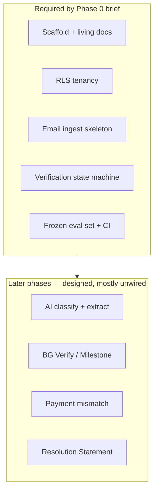

---

# Chapter 0 — Origin: brief, extensions, research

## 1. Concept

There is **no `Task.pdf`** in this repo (*observed*: search found none). The “assignment”
is the product + engineering brief distributed across:

| Source | Role |
|--------|------|
| `docs/plans/phase-0-foundation.md` | Ordered build plan and gates |
| `specs/00-foundation/requirements.md` | 18 EARS requirements (R-F1…R-F18) |
| `specs/00-foundation/design.md` | Design mapping requirements → decisions |
| `docs/architecture/HLD.md` / `LLD.md` | System and data design |
| `Equicontracts Reference Documents/` | Real `.msg` samples (local; not the eval bucket) |
| `DECISIONS.md` | Why each architectural fork was taken |

### Required deliverables (Phase 0 brief)

From `docs/plans/phase-0-foundation.md` § Scope — **In**:

- Repo scaffold, agent rule files, living documents (`DECISIONS.md`, `FLOW.md`)
- Access model for contractor **and** client/PMC
- Postgres RLS with `FORCE`
- Document ingestion via dedicated project email (HMAC, quarantine, private storage)
- Three-state verification skeleton
- Frozen eval set + CI enforcement
- Walking skeleton (API + minimal web) + reference slice

**Explicitly out of Phase 0:** real extraction accuracy tuning, WhatsApp, full client product
dashboard (plan text says Phase 5 for that; a verified-only stub exists), Resolution
Statement, accounting API connectors, Temporal.

### Extensions (beyond the minimum brief, and why)

These appear in code/docs beyond “scaffold + skeleton”:

| Extension | Why |
|-----------|-----|
| Participant-aware RLS (`can_read_project`) | Product needs one shared record; client/PMC cannot be “another contractor tenant” |
| Limited system role for inbound address resolution (D-012) | Resolve `to:` before org is known without `BYPASSRLS` |
| Hash-chained `event_log` | R-F17; dispute evidence must be tamper-evident |
| Eval harness that scores financial vs non-financial **separately** | Wrong ₹ is worse than wrong BG number; one blended accuracy hides that |
| YAML rule definitions + pure Python matchers before full `evaluate()` | Trust boundary for rules exists before Phase 1 wires exceptions |
| Next.js route groups `(contractor)` / `(client)` | Encode the access asymmetry in the filesystem so agents cannot “accidentally” share UI |

### Research

*Inference from docs, not a literature review folder:* Indian construction contracting
practice (BG dual dates, RA bills, Client Clock, GSTIN state codes) is captured in
`docs/domain/glossary.md` and `docs/domain/dataset-findings.md`. Appendix C lists open
research threads; nothing under `docs/` is a formal paper citation list yet.

## 2. Code

Foundation requirements are the contract:

```1:18:specs/00-foundation/requirements.md
# Foundation Requirements (EARS notation)

Phase 0 requirements. Format: `R-F{N}` = Foundation requirement number N.

---

## Access control

**R-F1** WHEN a contractor user authenticates, the system SHALL scope all queries to
their org via RLS session variable.

**R-F2** WHEN a client or PMC user authenticates, the system SHALL scope queries to
projects where their org is a participant.

**R-F3** IF a request references a project the principal's org neither owns nor
participates in, THEN the system SHALL respond identically to a non-existent project.
```

Task checklist status (*observed* `specs/00-foundation/tasks.md`): scaffold and specs
marked complete; Docker-dependent gates and remaining eval transcriptions still open.

## 3. Numbers

From this workspace on 2026-08-13 (*observed* commands in Appendix B):

| Metric | Value | Source |
|--------|------:|--------|
| EARS foundation requirements | 18 | `requirements.md` R-F1…R-F18 |
| Decisions logged | D-001 … D-016 | `DECISIONS.md` |
| Eval cases in manifest | 11 | `eval/eval_set_v0/cases.json` |
| Cases with expected JSON | 2 transcribed | `validate_fixtures` → `11 cases, 2 transcribed` |
| Pytest functions in tree | 34 | count over `apps/api/tests` + `packages/extraction/tests` |
| DB-independent tests this run | 22 passed | `pytest` excluding live DB suites |
| Live DB/RLS tests this run | 2 failed + 10 errors | Postgres not accepting connections (`Connection refused`) |

So: **logic and fixtures are exercised; tenancy gates are present but not green without Docker.**

## 4. Takeaway

> EquiContracts Phase 0 is not “build an AI extractor.” It is “build a trust and tenancy
> shell so that when AI arrives, unverified money cannot reach a client dashboard.” The brief
> is the EARS requirements + phase plan; everything else is either an extension that
> protects that shell or Phase 1+ work that is designed but deliberately unwired.

---

# Chapter 1 — Product thesis & access asymmetry

## 1. Concept

Construction projects drown in email: BGs, WCCs, RA bills, disputes. EquiContracts turns
that stream into structured data **without** making the client a data-entry clerk or the
contractor feel like they opened another ERP.

The asymmetry is the product:

- **Contractor org** owns the project, feeds documents, reviews AI fields.
- **Client / PMC** see **verified** exceptions and dashboards only.
- The platform classifies, extracts, and surfaces risk — it is not the system of record for
  accounting (that stays in Tally/SAP; reconciliation is phased).

If you invert this (client edits fields; unverified AI on client screens), you lose both
audiences at once.

## 2. Code

HLD states the thesis. Full diagram is in Chapter 11 §HLD-1; the critical edge is
`REVIEW -->|verified only| PG`. Unverified AI output must never reach a client dashboard.

Entry points encode the same split (`FLOW.md` §1): contractors hit `/projects`,
`/review/*`; clients hit `/client/dashboard` with a verified-only filter; inbound email is
the only third-party-facing path and is HMAC-gated.

Web layout mirrors it: `apps/web/app/(contractor)/` vs `apps/web/app/(client)/`.

## 3. Numbers

*Observed* client page copy and API contract: the dashboard page fetches
`getVerifiedClientDashboard()` and renders `verified_field_count` only — no raw documents
(*code* `apps/web/app/(client)/dashboard/page.tsx`).

*Observed* mutation map (`FLOW.md` §4): domain tables like `bank_guarantee` are **never**
written by extraction; only promotion from verified `extracted_field` rows may populate them.
That indirection is the product thesis as a write policy.

## 4. Takeaway

> Remember the edge, not the boxes: **AI may propose; humans (contractors) verify; clients
> only see verified.** Every module either feeds that edge or reads after it.

---

# Chapter 2 — Monorepo map & living documents

## 1. Concept

Early features span schema + API + UI. A monorepo (D-001) lets one PR carry the whole
change. Three “living” files prevent agents from inventing call paths:

| File | Job |
|------|-----|
| `BOOK.md` | Complete technical report: all HLD/LLD diagrams, every gate |
| `FLOW.md` | Where control goes; update when entry points change |
| `DECISIONS.md` | Why a fork was taken; append-only |
| `AGENTS.md` + `.cursor/rules/*.mdc` | Non-negotiables + directory-scoped rules |

## 2. Code

Layout (*observed*):

```
apps/api/          FastAPI — routers, core, rules, (future) workflows/generation
apps/web/          Next.js App Router — (contractor) / (client)
packages/db/       SQL migrations + seed
packages/extraction/  Classifier/extractors (Phase 1) + eval harness (Phase 0)
eval/eval_set_v0/  Frozen cases + expected JSON (documents gitignored)
specs/             Requirements, design, ADRs
docs/              HLD/LLD, phase plans, domain
scripts/           CI rule checkers
```

Agent ownership is explicit in `AGENTS.md` (schema-agent, api-agent, …). Max three
concurrent code-writing agents — *policy*, not enforced by a lockfile.

## 3. Numbers

*Observed* `DECISIONS.md`: 16 accepted decisions (D-001–D-016), including D-015 (document
participant reads) and D-016 (shared inbox plus-addressing).

## 4. Takeaway

> Before changing behaviour, read `FLOW.md`. Before choosing a library or boundary, append
> `DECISIONS.md`. The monorepo is the container; those two files are the memory.

---

# Chapter 3 — Tenancy: Postgres RLS

## 1. Concept

Two HVAC subcontractors on the same tower must never see each other’s rates. Application
`WHERE org_id = …` fails the first night an agent forgets it. Postgres **Row Level Security
with `FORCE`** makes isolation a property of the database role.

**Why FORCE?** Plain `ENABLE ROW LEVEL SECURITY` exempts the table owner. Tests run as owner
would pass while production (app role) might be open — false confidence (D-002).

**Why a provisioning connection?** Creating an `org` is pre-tenant: there is no
`app.current_org_id` yet. Giving the app `BYPASSRLS` would undo tenancy. A narrow admin URL
used only for signup/fixtures is the explicit exception (D-003).

**Why `project_participant`?** Clients and PMCs need read access to the same project without
owning it. Read policy = owner OR participant; write policy = owner only (D-004).

## 2. Code

Session helpers set a **transaction-local** GUC (`is_local => true` in app code — see
`FLOW.md` sequence diagram) so pooled connections cannot leak org across requests.

RLS helpers:

```3:47:packages/db/migrations/0002_rls.sql
CREATE FUNCTION current_org_id()
RETURNS uuid
...
CREATE FUNCTION can_read_project(target_project_id uuid)
...
        p.owner_org_id = public.current_org_id()
        OR EXISTS (
          SELECT 1
          FROM public.project_participant pp
          WHERE pp.project_id = p.id
            AND pp.org_id = public.current_org_id()
        )
...
CREATE FUNCTION owns_project(target_project_id uuid)
```

Policies then `FORCE` RLS on `org`, `project`, `project_participant`, etc.

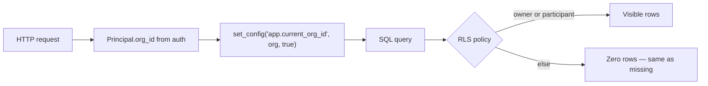

## 3. Numbers

*Observed* this run: access-control and DB-constraint tests **did not pass** because
Postgres refused connections on `127.0.0.1:5432`. The tests exist (including rival-on-shared-site
and unset-org-id cases per `.cursor/rules/60-tests.mdc`); green counts require `make up`.

*Inference:* with Docker healthy, `make reset` then `make verify` should exercise the ~12
DB/RLS tests noted in `FLOW.md` session 02.

## 4. Takeaway

> Tenancy is not a middleware habit — it is `FORCE ROW LEVEL SECURITY` + session GUC.
> Forgetting the GUC returns **zero rows**, not an error; that is why the unset-org test exists.

---

# Chapter 4 — Ingestion: email → storage → document

## 1. Concept

Each project is routed on **one shared mailbox** via plus-addressing (D-016):
`projects+{alias}@{domain}` (example: `projects+ecmum101@equicontracts.in`). The database
stores unique `project.inbound_alias` only. Bare `projects@domain` (no `+`) is treated as
unknown and quarantined — the system must not guess. Forwarding existing mail is the
contractor UX; WhatsApp is deferred (D-007).

*Observed risk (D-016):* some clients strip `+alias` on **manual** forward. Provider
inbound that preserves the original recipient is the intended path.

Threat model for `POST /inbound/email`:

1. Forged webhook → inject fake BGs into any project → **HMAC first** (R-F9).
2. Unknown recipient → do not create tenant documents → **quarantine** (R-F10).
3. Storage must be private and content-addressed → **local SHA-256** before trust in
   provider hashes (R-F11).

Phase 0 deliberately stops before classify/extract: the walking skeleton proves the pipe.

## 2. Code

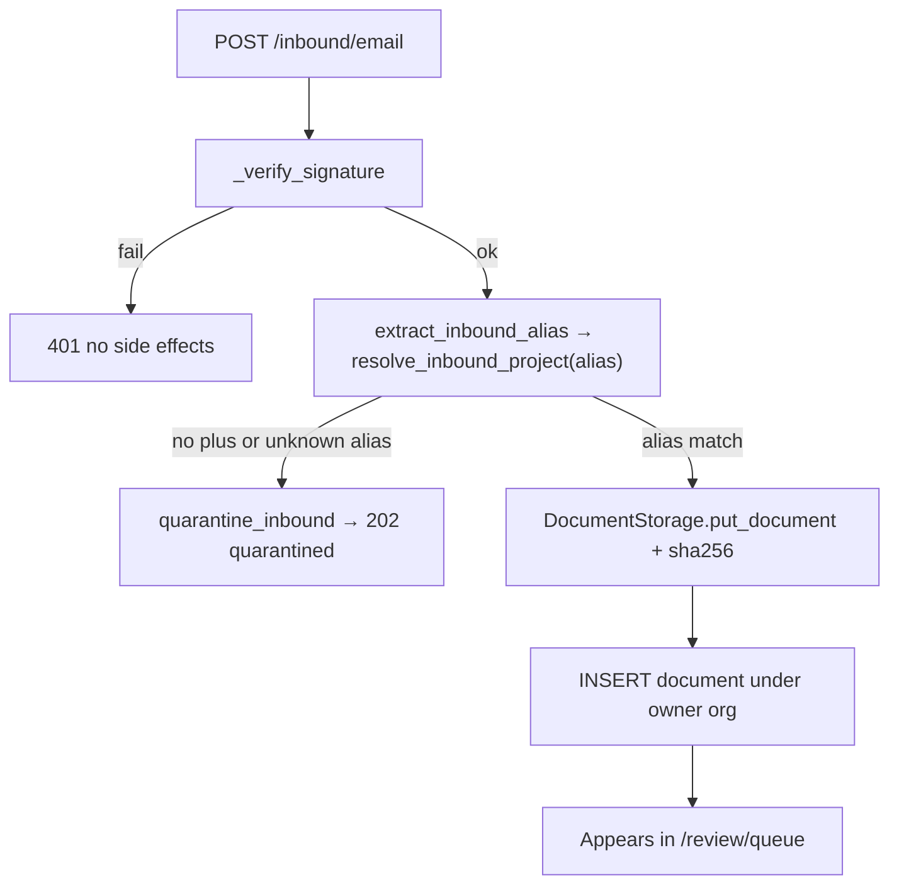

Signature verification uses `hmac.compare_digest` (timing-safe):

```36:46:apps/api/app/routers/inbound.py
def _verify_signature(raw_body: bytes, supplied_signature: str) -> None:
    expected = hmac.new(
        get_settings().inbound_email_hmac_secret.encode(),
        raw_body,
        hashlib.sha256,
    ).hexdigest()
    if not hmac.compare_digest(expected, supplied_signature):
        raise HTTPException(
            status_code=status.HTTP_401_UNAUTHORIZED,
            ...
        )
```

Address resolution uses a **privileged** session calling a limited SQL function; document
insert uses **org-scoped** session for the project owner (D-012). Reminder sequence is
parsed from subject (`reminder 3` → `3`) for Client Clock / chase logic later.

## 3. Numbers

*Observed* entry table in `FLOW.md`: inbound is the only unauthenticated third-party path.
*Observed* dedupe: `ON CONFLICT (project_id, sha256) DO UPDATE SET received_at = …` — same
bytes under the same project do not create a second logical document id path beyond upsert.

No live MinIO put was run in this teaching session (*observed*: Docker down). Unit suite
`test_storage.py` / `test_inbound.py` are among the 22 passed DB-independent tests when
storage is mocked or not requiring live DB — confirm per test markers when extending.

## 4. Takeaway

> Order is sacred: **HMAC → resolve → store → tenant insert**. Swap that order and you
> either open an injection door or write orphan rows.

---

# Chapter 5 — Verification trust boundary

## 1. Concept

Extracted fields are not “true.” They move through three states (R-F13, D-005):

| State | Meaning |
|-------|---------|
| `ai_extracted` | Model wrote a value (may be unused if finance forces review) |
| `needs_review` | Must be confirmed or corrected by a contractor human |
| `verified` | Safe to promote toward domain tables / client views |

**Financial fields always need review** (R-F12), even at confidence 1.0 — a confident wrong
₹17,080,000 is still catastrophic.

Corrections **supersede** (new row + `superseded_by`) rather than overwrite (R-F15): that
pair is the future fine-tune signal. Contradictions pull `verified` back to `needs_review`
(R-F16), never silent overwrite.

## 2. Code

```11:20:apps/api/app/core/verification.py
def next_state(*, is_financial: bool, confidence: Decimal | None) -> VerificationState:
    if is_financial or confidence is None or confidence < AUTO_VERIFY_THRESHOLD:
        return "needs_review"
    return "verified"
```

`AUTO_VERIFY_THRESHOLD = Decimal("0.900")`.

DB also enforces financial→verified requires `verified_by` (R-F14) — application and
constraint together (defense in depth).

Audit: `append_event` hash-chains metadata (no field values in app logs — R-F18):

```34:47:apps/api/app/core/event_log.py
    canonical = json.dumps(
        {
            "project_id": str(project_id),
            "event_type": event_type,
            ...
            "previous_hash": previous_hash,
        },
        sort_keys=True,
        separators=(",", ":"),
    )
    event_hash = hashlib.sha256(canonical.encode()).hexdigest()
```

## 3. Numbers — algebra step-by-step

Threshold constant: \( T = 0.900 \) (*observed* `AUTO_VERIFY_THRESHOLD`).

Rule (non-financial):

\[
\text{state} =
\begin{cases}
\texttt{needs\_review} & \text{if } c = \bot \lor c < T \\
\texttt{verified} & \text{if } c \ge T
\end{cases}
\]

Rule (financial): always `needs_review`, **independent of** \( c \).

*Observed* REPL against this repo’s function:

| Inputs | Predicate | Result |
|--------|-----------|--------|
| financial=True, \( c=0.99 \) | financial short-circuit | `needs_review` |
| financial=False, \( c=0.99 \) | \( 0.99 \ge 0.900 \) | `verified` |
| financial=False, \( c=0.899 \) | \( 0.899 < 0.900 \) | `needs_review` |
| financial=False, \( c=\bot \) | missing confidence | `needs_review` |
| financial=False, \( c=0.900 \) | \( 0.900 \ge 0.900 \) | `verified` (*test*) |

Boundary gap: \( T - 0.899 = 0.001 \) separates reject vs accept for non-financial.
Allowed “confidence miss” budget below perfect: \( 1 - T = 0.100 \).

Why test the “obvious” financial case? Because a future refactor that “trusts high
confidence” would silently ship money to clients — the example test pins the product law;
property tests later can fuzz \( c \in [0,1] \), but the **invariant** is the law.

## 4. Takeaway

> **Money never auto-verifies.** Confidence only unlocks non-financial fields at
> \( c \ge 0.900 \). Everything client-visible must cross this boundary.

---

# Chapter 6 — Domain tables & dual BG dates

## 1. Concept

Master chain (HLD): Project → Work Order → Contractor → Module → Document type → Date →
Status → Action owner.

Bank guarantees have **two** dates (D-006): `expiry_date` (instrument validity) and
`claim_expiry_date` (how long the beneficiary may still invoke after expiry). Collapsing
them into one field produces wrong alerts and wrong legal timelines.

## 2. Code

Migrations `0004_work_orders_annexures.sql`, `0005_bg_verify.sql`, `0006_milestone_chain.sql`
encode the LLD entities. Frozen expected output for the GECPL case shows the dual dates
explicitly:

```1:21:eval/eval_set_v0/expected/gecpl-bg-invocation.json
{
  "category": "bg_document",
  "fields": {
    "bg_number": { "value": "0544BGR0097618", "financial": false },
    "value": { "value": "17080000.00", "financial": true },
    "expiry_date": { "value": "2023-04-23", "financial": true },
    "claim_expiry_date": { "value": "2024-04-23", "financial": true }
  }
}
```

## 3. Numbers

BG value string `"17080000.00"` — *observed* as decimal **string** in fixtures (never JSON
number) to avoid float binary error. Date delta:

\[
\text{claim\_expiry} - \text{expiry} = 2024\text{-}04\text{-}23 - 2023\text{-}04\text{-}23 = 366\ \text{days}
\]

(2024 is a leap year; 23 Apr 2023 → 23 Apr 2024 includes Feb 29.)

*Inference:* claim window ≈ 1 year after expiry — typical in Indian BG practice; the code
stores both rather than assuming +365.

## 4. Takeaway

> Domain tables are filled from **verified** fields, not from the extractor. BG has two
> clocks; one date field is a design bug, not a simplification.

---

# Chapter 7 — Rules engine (deterministic)

## 1. Concept

Expiry alerts and payment mismatches must not depend on model mood. Rules are pure
functions of DB state + injected `now` (D-009). YAML holds definitions; Python loads them
safely (D-014). No Anthropic/OpenAI imports under `apps/api/app/rules/` — CI greps for it.

## 2. Code

```23:40:apps/api/app/rules/engine.py
def load_definitions(path: Path = DEFINITIONS) -> tuple[RuleDefinition, ...]:
    ...
def pending_financial_review_matches(
    *,
    is_financial: bool, state: str, now: datetime,
) -> bool:
    del now
    return is_financial and state == "needs_review"
```

Full `evaluate(work_order_id, now)` upserting exceptions is designed in `FLOW.md` §3.3;
Phase 0 ships the pure primitives and one YAML definition
(`pending_financial_review.yaml`).

## 3. Numbers

*Observed:* at least one YAML definition on disk under `apps/api/app/rules/definitions/`.
`now` is a required parameter even when unused — so tests can freeze time for expiry math
later without rewriting call sites.

## 4. Takeaway

> If a rule needs an LLM to decide, it is not a rule — it is extraction or generation.
> Keep that boundary boring.

---

# Chapter 8 — Extraction & frozen eval

## 1. Concept

You cannot tune a model without a frozen scoreboard. `eval/eval_set_v0/` holds case
metadata + hand-transcribed expected JSON. **Documents themselves are gitignored** (DPDP /
client confidentiality). Expected outputs are CI-frozen (D-010): agents must not “fix”
accuracy by editing gold labels.

Phase 0: harness validates fixtures and scores field equality; `run_extraction` raises
`NotImplementedError` on purpose.

## 2. Code

Accuracy:

\[
\text{ratio} = \frac{\#\{ \text{fields with actual.value} = \text{expected.value} \}}{\#\{\text{selected fields}\}}
\]

Selection splits on `financial` flag so money and metadata never share a denominator:

```37:56:packages/extraction/eval_harness.py
def score_fields(expected, actual, *, financial: bool) -> Accuracy:
    ...
    selected = [
        (name, definition)
        for name, definition in expected_fields.items()
        if bool(definition.get("financial")) is financial
    ]
    correct = sum(
        1 for name, definition in selected
        if name in actual_fields
        and actual_fields[name].get("value") == definition.get("value")
    )
    return Accuracy(correct=correct, total=len(selected))
```

Raheja tax invoice expected file teaches GST: same-state GSTINs ⇒ CGST+SGST; `igst`
must stay `null` (*observed* assertions in `raheja-tax-invoice.json`).

## 3. Numbers

*Observed* `python -m packages.extraction.eval_harness --validate-fixtures`:

```
eval fixtures valid: 11 cases, 2 transcribed
```

Harness unit test (*observed* logic): non-financial `bg_number` match ⇒ ratio \(1/1 = 1\);
financial `value` `100.00` vs `99.00` ⇒ ratio \(0/1 = 0\).

Default `main()` without `--validate-fixtures` exits **2** with message that extractors are
unwired — intentional fail-closed for CI wiring later.

## 4. Takeaway

> Freeze gold labels before you train. Score **₹ separately** from labels. A single
> “accuracy %” that mixes both will lie to you.

---

# Chapter 9 — Web surfaces

## 1. Concept

Filesystem route groups enforce audience:

- `(contractor)` — setup, review queue (write path)
- `(client)` — verified dashboard only (read path)

Dev auth is header-based in Phase 0; signed tokens replace it later (`FLOW.md`).

## 2. Code

Client page refuses to narrate drafts:

```5:14:apps/web/app/(client)/dashboard/page.tsx
export default async function ClientDashboardPage() {
  const projects = await getVerifiedClientDashboard();
  ...
        This view contains verified records only. Draft extraction and internal
        contractor notes are excluded by the API and database policies.
```

## 3. Numbers

*Inference:* without `make up` + seeded orgs, the dashboard returns empty or errors — not
measured in this session. Structure exists; live browser walkthrough is still an open task
in `specs/00-foundation/tasks.md`.

## 4. Takeaway

> If a component lives under `(client)`, treat unverified data as a **security bug**, not a
> UX bug.

---

# Chapter 10 — CI, agents, and which test when

## 1. Concept

Agents write fast and forget tenancy. CI encodes the non-negotiables from `AGENTS.md`
(no float money, no LLM in rules, no skipping tests, no mutating frozen eval, etc.).

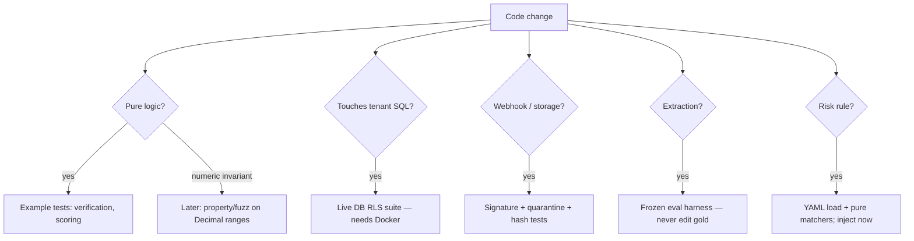

**Why example tests for “common knowledge”?** They document product law for agents and
future humans. Property tests explore the continuum; example tests name the landmines
(`financial + confidence 1.0` still `needs_review`).

## 2. Code

`make verify` ≈ rules + lint + typecheck + test (target &lt; 60s). Workflows under
`.github/workflows/`. Scripts like `scripts/check_agent_rules.py` enforce agent conventions.

## 3. Numbers

*Observed* 2026-08-13:

- 22 passed without live Postgres
- Full `make verify` failed on DB connection refused
- 34 `test_*` functions present in tree
- Eval: 2/11 transcribed

## 4. Takeaway

> Green unit tests without Docker are necessary but not sufficient. **RLS tests are the
> product.** Run them before you trust a tenancy change.

---

# Chapter 11 — Architecture atlas (HLD + LLD)

Every diagram from [HLD.md](docs/architecture/HLD.md) and [LLD.md](docs/architecture/LLD.md)
is reproduced here in full. Captions state what a technical reader must take from the
picture. Source files remain the edit origin; if they drift, this chapter is updated in
the same pass.

---

## HLD-1 — System context

Contractor writes. Client/PMC read verified data only. The edge `REVIEW -->|verified only|
PG` is the product.

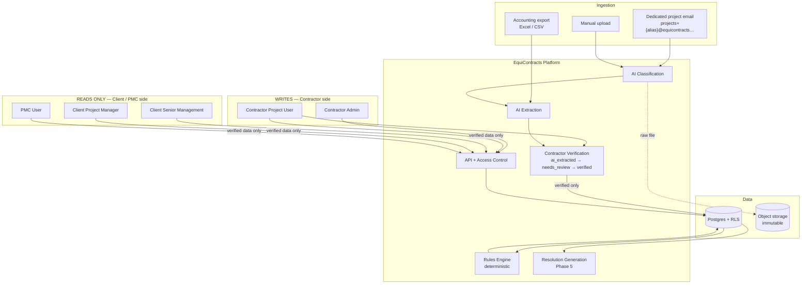

**Status.** Ingest HMAC + document insert + review queue + verified-only client count:
*observed* in code. Classify / extract / rules evaluate / resolution generation: designed,
mostly unwired (Phase 1–5).

---

## HLD-2 — Master data backbone

If a record cannot sit on this chain, it is malformed.

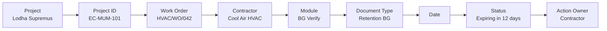

`action_owner` defaults to contractor. Client/PMC owners exist when the blockage is theirs
(certification ageing / Client Clock).

---

## HLD-3 — Access model

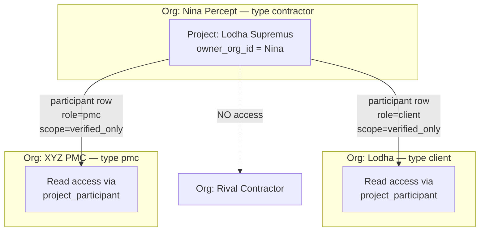

Three rules: (1) contractor sees only own projects; (2) client sees verified data only
across contractors on participant projects; (3) internal notes never leak. Rival isolation
is existential.

---

## HLD-4 — Module dependency order

Built in dependency order, not marketing order. Resolution last because it is only as good
as project memory.

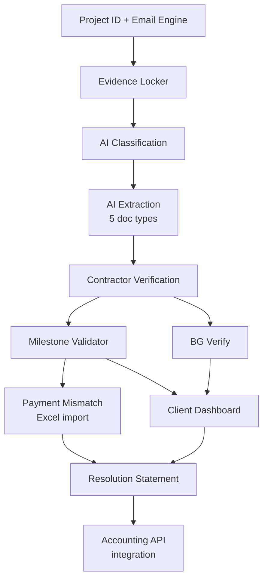

**Phase numbering (authoritative):** 0 foundation → 1 BG Verify → 2 Milestone → 3 Evidence
Locker → 4 Payment Mismatch → 5 Resolution. Accounting APIs are post-pilot, not Phase 5.

---

## HLD-5 — Layer architecture

AI (L4) never writes domain tables. It proposes `extracted_field`; promotion after
`verified` creates `bank_guarantee` and friends.

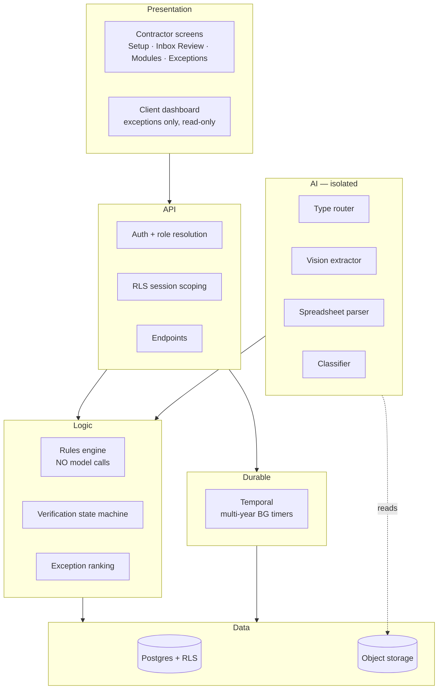

**Status.** L1 walking skeleton, L2 four routers + header-auth stub, L3 verification + YAML
loader, L4 eval harness only (`run_extraction` raises), L5 Temporal explicitly out of Phase
1, L6 Postgres+MinIO when Docker is up.

---

## HLD-6 — Accounting integration, phased

Excel first. Live Tally/SAP is post-pilot (Phase 4c), not day one.

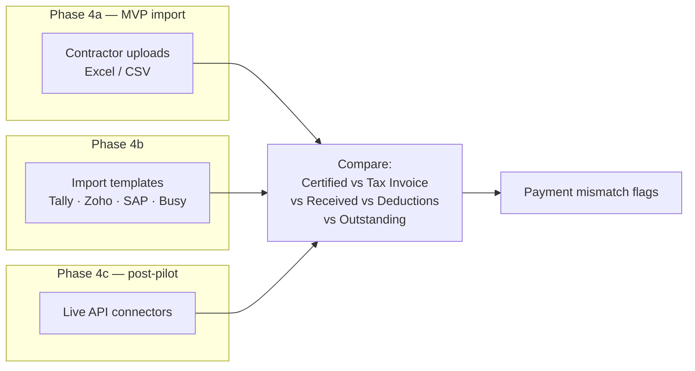

---

## LLD-1 — Entity relationship

*Observed drift:* LLD source still labels `PROJECT.inbound_email`. Runtime schema after
intended `0008` is `inbound_alias` (unique). ER below uses the **intended** column. Tables
`WCC`, `WARRANTY`, `CERTIFICATION`, `TAX_INVOICE`, `PAYMENT_RECEIPT`, `DEDUCTION_LINE`,
`EXCEPTION` are designed; several are not migrated yet (`0006` is a comment stub).

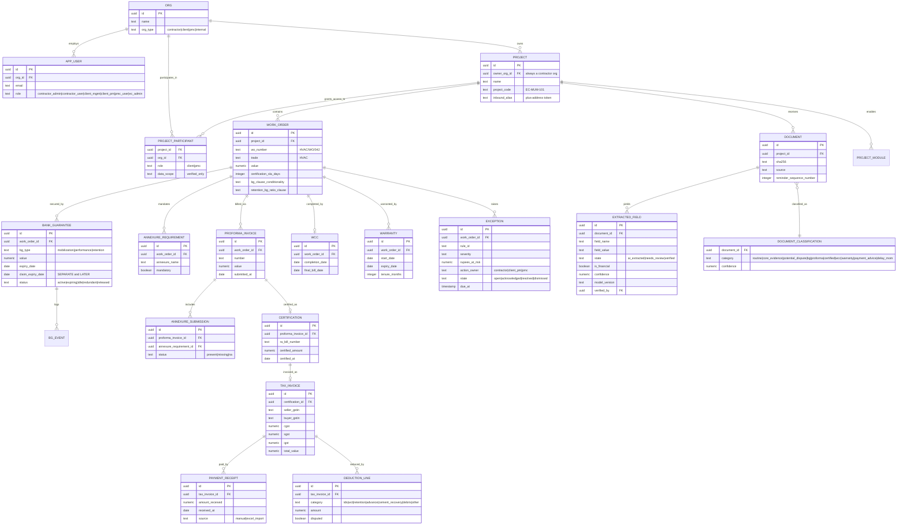

---

## LLD-2 — Verification state machine

Financial fields have only one path to `verified`: human confirm. `verified → needs_review`
on contradiction is required (R-F16).

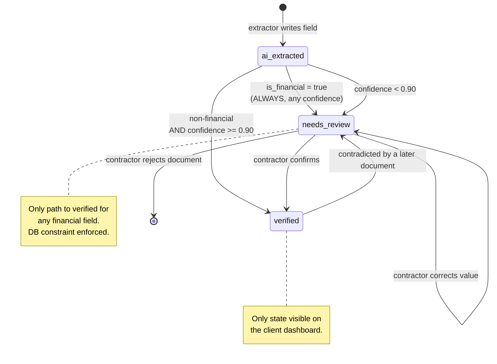

---

## LLD-3 — Sequence: email ingestion to verified field

Phase 0 *observed* path stops after document insert + review queue (“Awaiting extraction”).
Classifier, extractor, and rules evaluate are Phase 1+ (dashed in FLOW §3.1).

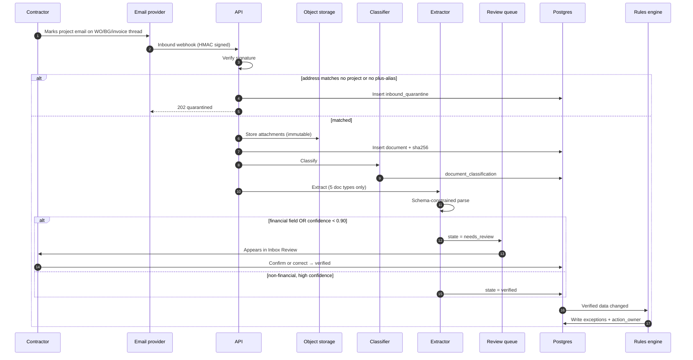

HMAC **before** any side effect. Unsigned inbound is an open injection door.

---

## LLD-4 — Sequence: idle BG detection

A BG is idle when work is finished but the instrument is still live (bank commission).
Claim expiry is a **separate** clock.

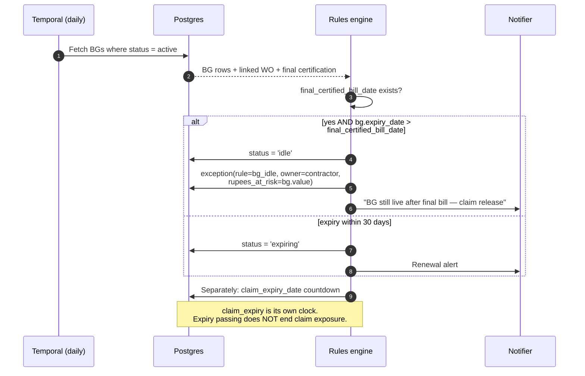

**Status.** Phase 1 plan uses a simple scheduled job first; Temporal is explicitly out of
Phase 1 scope.

---

## LLD-5 — Sequence: payment mismatch via Excel import

Spreadsheets: `openpyxl`, not vision.

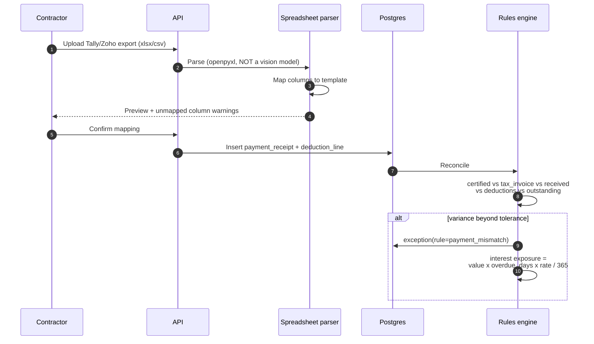

**Status.** Phase 4. Router `imports.py` does not exist yet.

---

## LLD-6 — Exception lifecycle

Dismissals require a reason — they are the noise-tuning signal.

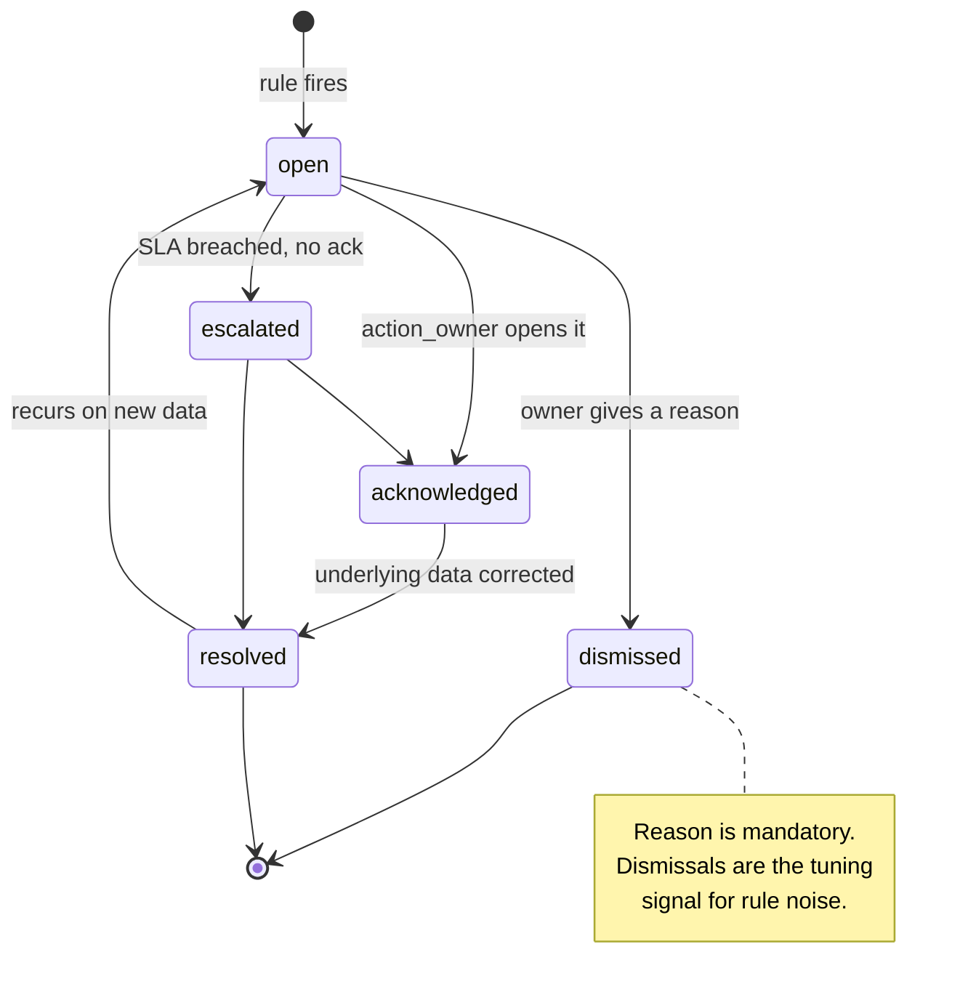

**Status.** `exception` table not migrated. Rules engine loads YAML; `evaluate()` upsert is
designed in FLOW §3.3, not an entry point.

---

## LLD-7 — Client dashboard composition

Fixed vocabulary: `healthy`, `critical`, `needs_verification`, `pending_contractor`,
`pending_client_pmc`, `resolved`.

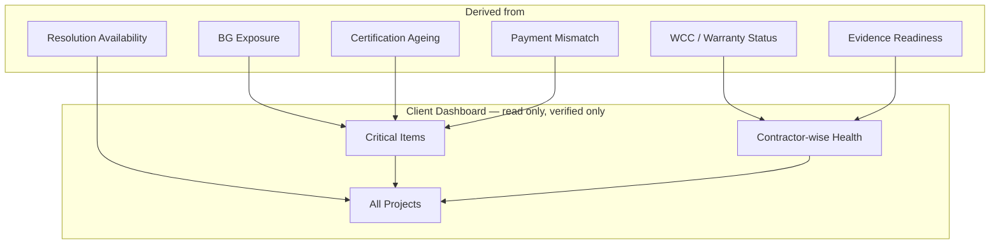

**Status.** Walking skeleton `GET /client/dashboard` counts verified `extracted_field` rows
via `document` join — not exception aggregates. FLOW §3.4 still describes exceptions
(*documented drift*; do not “fix” FLOW in this chapter without a dedicated pass).

---

# Appendix A — Glossary

Use [`docs/domain/glossary.md`](docs/domain/glossary.md) as canonical. Do not paraphrase BG,
WCC, DLP, RA bill, Client Clock, or GSTIN rules in generated docs.

---

# Appendix B — Reproducibility commands

Commands that produced numbers in this book (run from repo root):

```bash
# Fixture scoreboard
.venv/bin/python -m packages.extraction.eval_harness --validate-fixtures

# Verification threshold behaviour
.venv/bin/python -c "from decimal import Decimal; from apps.api.app.core.verification import next_state, AUTO_VERIFY_THRESHOLD; \
print(AUTO_VERIFY_THRESHOLD); \
print(next_state(is_financial=True, confidence=Decimal('0.99'))); \
print(next_state(is_financial=False, confidence=Decimal('0.899')))"

# DB-independent tests (approximate; adjust ignores as needed)
.venv/bin/python -m pytest apps/api/tests packages/extraction/tests -q \
  --ignore=apps/api/tests/test_access_control.py \
  --ignore=apps/api/tests/test_database_constraints.py

# Full gate (needs Docker Postgres + MinIO)
make up && make reset && make verify
```

---

# Appendix C — Research notes

| Thread | Status | Notes |
|--------|--------|-------|
| Indian BG claim period vs expiry | Domain convention captured in D-006 + GECPL fixture | Formal statute cites not yet collected in-repo |
| GST same-state ⇒ CGST+SGST | Encoded in Raheja expected assertions | Extractor unwired; assertion is the research artifact |
| DPDP / document retention | Documents gitignored; private MinIO bucket required | Legal review not in this repo |
| Email vs WhatsApp ingestion | D-007 defers WhatsApp | Revisit when pilot users demand it |
| Exception ranking `rupees_at_risk × urgency` | Designed in FLOW §3.3 | Not implemented as entry point yet |

---

# Appendix D — Status ledger (report everything)

Snapshot *observed* 2026-08-15 unless noted. This appendix is the anti-omission table.
If it is not listed, it was forgotten — add it.

## Environment

| Item | Status | Evidence |
|------|--------|----------|
| Docker Engine / Desktop | Running | Server 29.7.2; Postgres + MinIO containers healthy |
| Python 3.12 | **Missing** | `python3.12` not found; venv is 3.11.9 |
| `make up` | Succeeded | postgres `:5432` healthy, minio `:9000-9001` healthy |
| `make reset` | **Failed** | `0008_inbound_alias.sql`: `cannot change name of input parameter "target_recipient"` — need `DROP FUNCTION resolve_inbound_project(text)` first |
| `make verify` after reset | **Not completed** | Blocked by 0008 |
| Live DB after failed reset | **Inconsistent** | Column renamed to `inbound_alias`; resolve fn still `target_recipient` and old body |

## Prompt / workstream sequence

| Item | Code | Live |
|------|------|------|
| RLS participant document reads (0007 + test + D-015) | Done | Applied in partial reset; suite not green-proven |
| FLOW.md `work_order` two write paths | Done | n/a (docs) |
| Plus-addressing (0008 + inbound parse + D-016) | Done except 0008 DROP | Migration fails; function not replaced |
| Docker | Done | Healthy |
| Python 3.12 | Not done | — |
| Fix DB test failures one-by-one | Not started | Waiting on reset |
| GECPL real-document E2E gate | Not started | Extractor unwired; expected JSON exists |

## Migrations

| File | Status |
|------|--------|
| 0001 orgs/access | Applied on last reset |
| 0002 RLS (`can_read_project`, `owns_project`) | Applied |
| 0003 documents/extraction | Applied |
| 0004 WO/annexures | Applied |
| 0005 BG dual dates | Applied |
| 0006 milestone chain | Comment stub only |
| 0007 document participant SELECT | Applied (`ALTER POLICY`) |
| 0008 inbound_alias | **Failed mid-file** after `ALTER TABLE` / `UPDATE 0` |

## Routers

| Router | Status |
|--------|--------|
| `projects` | Built — persists `inbound_alias`, returns display plus-address |
| `inbound` | Built — HMAC, plus parse, quarantine; DB resolve broken until 0008 |
| `review` | Built |
| `client_dashboard` | Built — verified field counts; FLOW still describes exceptions |
| `bg`, `milestones`, `exceptions`, `imports`, `advisor` | Missing (phases 1–5) |

## Tests / eval

| Item | Status |
|------|--------|
| Agent rules + lint (last run after plus-address) | Passed |
| `test_project_code` + `test_inbound` (no DB) | 10 passed |
| Full pytest incl. RLS | Last complete attempt: 22 passed, 12 DB blocked (connection refused, pre-Docker). After Docker: reset failed; suite not re-run to completion |
| Eval `eval_set_v0` | 11 cases; 2 expected JSON transcribed (`gecpl-bg-invocation`, `raheja-tax-invoice`) |
| `run_extraction` | Wired for `gecpl-bg-invocation` only via `bg_extractor`; other cases still raise |

## Security (pre-launch)

See [docs/security/pre-launch-checklist.md](docs/security/pre-launch-checklist.md). Auth is
still header stub (`X-Org-Id`). Nothing public until that is replaced. `#3` public DB key,
`#10` homemade passwords, `#12` CAPTCHA: skip for this product.

## Next unblocking step

1. Fix `0008` with `DROP FUNCTION resolve_inbound_project(text);` then `CREATE FUNCTION`.
2. `make reset && make verify`.
3. Report every failing test by name before changing tests or policies.
4. GECPL document through live inbound → extract (Phase 1) → verify → dashboard.

---

# Site (optional)

There is **no separate marketing/docs site** in this repo today (*observed*). Closest
“dashboard of headline numbers” is:

1. This book’s Chapter 0 numbers table
2. Contractor/client Next.js walking skeleton under `apps/web`
3. Eval harness stdout (`11 cases, 2 transcribed`)

If a docs site is added later, keep it to: headline metrics · pipeline walkthrough ·
decision flow (observed → decided → followed) — and link back here for depth.

---

*Book is the complete report. Expand chapters and Chapter 11 / Appendix D in place; do not
fork parallel tutorials. Last atlas/status update: 2026-08-15.*
