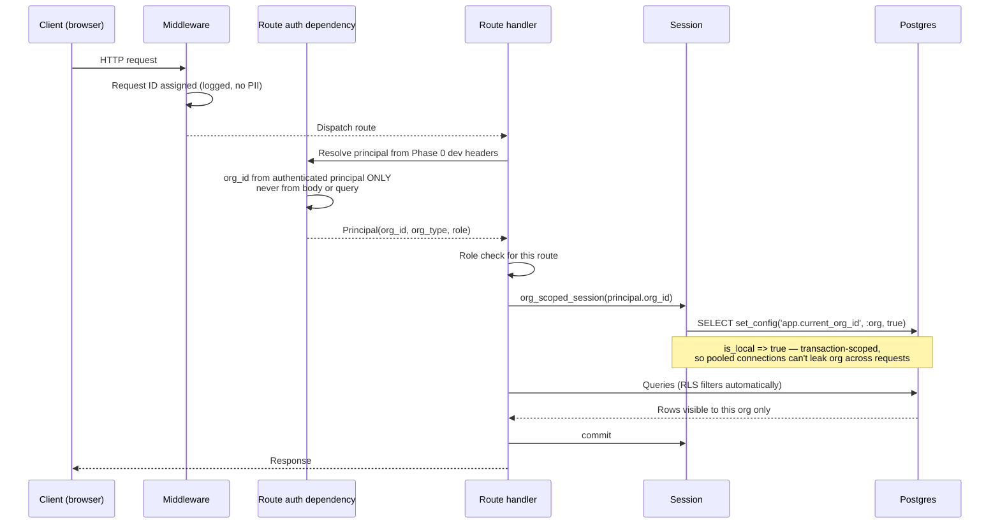
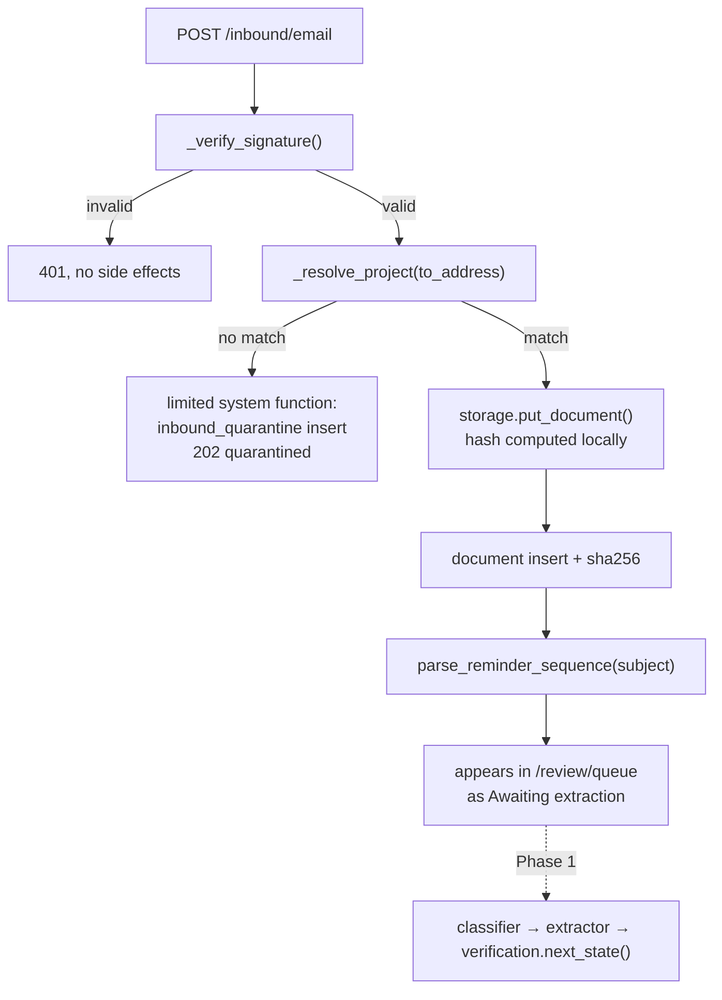
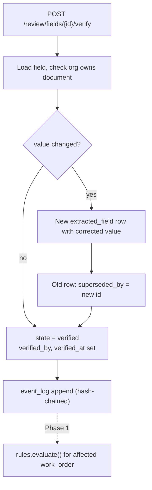
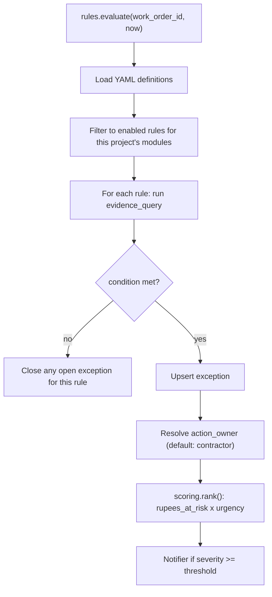
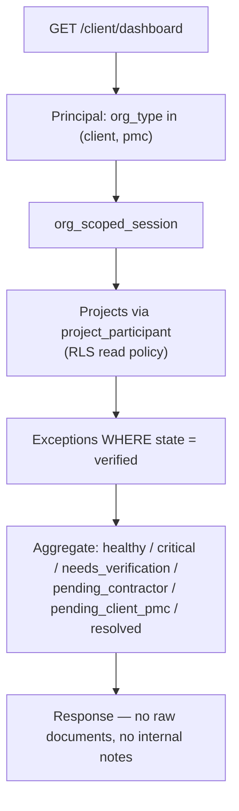

# Execution Flow

**Purpose.** Answer "where does control actually go" without reading the whole codebase.
Anyone — human or agent — starting a session should read this first.

**Maintenance rule (also in AGENTS.md):** any change that adds an entry point, changes the
request lifecycle, or introduces a new call path MUST update the relevant section here and
append to the session log.

---

## 1. Entry points

Every way execution begins. If it isn't listed here, it doesn't exist.

| Entry point                                  | Trigger                 | Handler                              | Auth                 | Org scoping                                      |
| -------------------------------------------- | ----------------------- | ------------------------------------ | -------------------- | ------------------------------------------------ |
| `GET /health`                                | HTTP                    | `main.health`                        | none                 | none                                             |
| `POST /projects`                             | Contractor UI           | `routers/projects.create_project`    | contractor_admin     | `org_scoped_session`                             |
| `GET /projects`                              | Contractor UI           | `routers/projects.list_projects`     | any contractor role  | `org_scoped_session`                             |
| `PATCH /projects/{id}/modules`               | Contractor UI           | `routers/projects.toggle_module`     | contractor_admin     | `org_scoped_session`                             |
| `POST /inbound/email`                        | Email provider webhook  | `routers/inbound.receive_email`      | **HMAC signature**   | `privileged_session` → then `org_scoped_session` |
| `GET /review/queue`                          | Contractor UI           | `routers/review.queue`               | contractor\_\*       | `org_scoped_session`                             |
| `POST /review/fields/{id}/verify`            | Contractor UI           | `routers/review.verify_field`        | contractor\_\*       | `org_scoped_session`                             |
| `GET /client/dashboard`                      | Client UI               | `routers/client_dashboard.overview`  | client\_\*, pmc_user | `org_scoped_session` + **verified-only filter**  |
| `python -m packages.extraction.eval_harness` | CLI                     | `eval_harness.main`                  | none                 | no DB                                            |
| `python -m packages.extraction.eval_harness --case gecpl-bg-invocation` | CLI | `eval_harness.run_case` → `bg_extractor.extract_bank_guarantee_from_path` → `_call_model` → `llm_config.get_llm_settings` → Anthropic SDK or OpenAI-compatible client | none | no DB |


**Two entry points deserve special attention.**

`POST /inbound/email` is the only endpoint reachable by an unauthenticated third party. It
verifies the provider HMAC **before** anything else. An unsigned endpoint here is an open
door for injecting forged documents into any contractor's project.

`GET /client/dashboard` is the only place non-contractor orgs read data. Every query in that
handler must carry `state = 'verified'`. CI greps for this.

---

## 2. Request lifecycle

The standard path. Deviations must be documented in this file.



**Phase 0 implementation.** Request ID is middleware; authentication and role checks are
FastAPI route dependencies. The resulting order remains Request ID → auth → role check →
session. Never open an app session before auth resolves, or you have a connection with no
org set. Signed-token authentication replaces the dev-header dependency in Phase 1.

---

## 3. Call graphs

### 3.1 Ingestion — Phase 0 email walking skeleton



The Phase 0 webhook proves HMAC verification, limited pre-tenant address resolution,
private storage, tenant-scoped document insertion and the review screen. Classification
and extraction remain deliberately unwired; `verification.next_state()` and its tests are
already present so Phase 1 has a trust boundary before model work begins.

### 3.2 Verification — contractor confirms a field



Corrections create a new row rather than overwriting. Both the original AI output and the
human correction survive — that pairing is the training signal for later fine-tuning.

### 3.3 Rule evaluation (Phase 1 design; not an entry point yet)



`now` is an injected parameter, never `datetime.now()` inside a rule. Otherwise the rules
aren't testable against fixed dates, which is exactly what you need for expiry logic.

### 3.4 Client dashboard read



---

## 4. Data mutation map

Which module may write which table. An unexpected write in a diff is a review flag.

| Table                                                               | Written by                                      | Never written by                |
| ------------------------------------------------------------------- | ----------------------------------------------- | ------------------------------- |
| `org`, `app_user`                                                   | `provisioning_session` (signup only)            | any router                      |
| `project`, `project_participant`                                    | `routers/projects`                              | client/PMC principals           |
| `document`                                                          | `routers/inbound`, `routers/documents` (upload) | rules, generation               |
| `document_classification`                                           | `packages/extraction/classifier`                | routers                         |
| `extracted_field`                                                   | `packages/extraction/*`, `routers/review`       | rules, generation               |
| `work_order`                                                        | setup: `routers/projects.create_project` writes base fields (`wo_number`, `trade`, `value`, `certification_sla_days`) from human-typed input; later extraction-derived fields (e.g. `bg_clause_conditionality`, `retention_bg_ratio_clause`) only via promotion from verified `extracted_field` | extraction directly             |
| `bank_guarantee`, `proforma_invoice`, `certification`               | promotion from verified `extracted_field` only  | extraction directly             |
| `exception`                                                         | `apps/api/app/rules/*`                          | extraction, generation, routers |
| `event_log`                                                         | `core/event_log.append()` only                  | anything else                   |
| `inbound_quarantine`                                                | `routers/inbound`                               | anything else                   |
| `resolution_statement`                                              | `apps/api/app/generation/*`                     | rules                           |

**The row worth internalising:** domain tables (`bank_guarantee` and friends) are never
written directly by the extractor. They are populated by promoting _verified_ fields. That
indirection is what keeps unreviewed AI output out of dashboards.

---

## 5. Session log

What AI changed, when, in which session. Keep the last ~20 entries here; archive older ones
to `docs/history/flow-archive-YYYY-MM.md`. An unbounded log stops being read, and an unread
document is worse than none because it creates false confidence.

Format:

```markdown
### YYYY-MM-DD · session NN · <tool> · <agent>

- **Task:** one line
- **Files touched:** paths
- **New call path:** entry → function → function
- **Not changed:** areas explicitly untouched
- **Verify run:** pass / fail (N tests)
- **Decision logged:** D-0NN or none
```

---

### 2026-08-12 · session 01 · manual · Adya

- **Task:** Phase 0 scaffold, rule files, living documents
- **Files touched:** repo root, `.cursor/rules/*`, `docs/**`, `DECISIONS.md`, `FLOW.md`
- **New call path:** none yet
- **Not changed:** no application code exists yet
- **Verify run:** n/a
- **Decision logged:** D-001 through D-010

<!-- Append new sessions below this line -->

### 2026-08-12 · session 02 · Cursor · foundation implementation

- **Task:** Implement Phase 0 database, API, CI, eval harness and walking skeleton
- **Files touched:** `packages/db/**`, `apps/api/**`, `apps/web/**`, `scripts/**`,
  `.github/workflows/**`, `eval/eval_set_v0/**`, root tooling and living docs
- **New call path:** project setup → `POST /projects` → org-scoped project row;
  signed inbound webhook → limited system lookup → private storage → org-scoped document
  row → contractor review queue
- **Not changed:** model extraction remains unwired; raw reference documents remain ignored
- **Verify run:** static checks and 22 database-independent tests pass; live DB gates blocked
  because Docker is unavailable; 12 database/RLS tests are present for CI
- **Decision logged:** D-011 through D-014

### 2026-09-09 · session · Cursor · BG extractor (GECPL only)

- **Task:** Bank-guarantee extractor + prompt + eval harness wiring for
  `gecpl-bg-invocation` only
- **Files touched:** `packages/extraction/prompts/bank_guarantee.v1.md`,
  `packages/extraction/bg_extractor.py`, `packages/extraction/document_text.py`,
  `packages/extraction/eval_harness.py`, `apps/api/requirements.txt`, `DECISIONS.md`
- **New call path:** `python -m packages.extraction.eval_harness --case gecpl-bg-invocation`
  → `run_extraction` → `extract_bank_guarantee_from_path` → model → schema fields;
  optional `process_bank_guarantee_document` persists `extracted_field` rows with
  `state='ai_extracted'` when category is `bg_document` / `bank_guarantee`
- **Not changed:** routers, other document types/schemas, promotion to `bank_guarantee`
- **Verify run:** not run (Docker down); single-case eval comparison reported in session
- **Decision logged:** D-017

### 2026-10-03 · session · Cursor · install planning kit + repo tidy

- **Task:** Install equicontracts-kit docs/rules; merge AGENTS.md; consolidate scattered root folders
- **Files touched:** `AGENTS.md`, `.cursor/rules/*`, `docs/WORKFLOW.md`, `docs/plans/{START_HERE,MASTER_PLAN_v2}.md`,
  `docs/architecture/AGENTIC_DESIGN.md`, `docs/prompts/*`, `HANDOFF.md`, `NEW_CHAT_PROMPT.md`,
  `DECISIONS.md`, `README.md`, `.gitignore`; moved reference materials under `docs/reference/`;
  removed root `rules/`, `Equicontracts files/`, `some mote/`, duplicate Start Here
- **New call path:** none
- **Not changed:** application code
- **Verify run:** `scripts/check_agent_rules.py` — 10 checks passed; `ruff` failed on 3 pre-existing E501 lines in `packages/extraction/{bg_extractor,document_text}.py` (untouched this session)
- **Decision logged:** D-018 through D-023

### 2026-10-03 · session · Cursor · LLM provider settings for BG extractor

- **Task:** Select extraction LLM from `.env` via `LLM_PROVIDER` / `LLM_MODEL` with one
  key slot per provider; wire anthropic vs OpenAI-compatible paths; offline tests; GECPL eval
- **Files touched:** `packages/extraction/llm_config.py`, `packages/extraction/bg_extractor.py`,
  `packages/extraction/tests/test_llm_config.py`, `.env.example`, `.env` (local only),
  `DECISIONS.md`, `FLOW.md`
- **New call path:** `_call_model` → `get_llm_settings()` → if `anthropic` then
  `_call_anthropic(model, api_key)` else `_call_openai_compatible` for
  `gemini` / `openai` / `ollama` (base URL default or `LLM_BASE_URL`)
- **Not changed:** eval fixtures, apps/, migrations, docs under `docs/`
- **Verify run:** `make verify` — All checks passed (45 pytest); GECPL eval 4/4,
  `model_version: gemini-2.5-flash`
- **Decision logged:** D-024, D-025

### 2026-10-03 · session · Cursor · docs cleanup

- **Task:** Docs cleanup — one index, formal decisions, honest HANDOFF/START_HERE steps 1–10;
  `git rm` obsolete BOOK/HLD/LLD/ADR/phase plans (not docs/archive); eval/README.md;
  MASTER_PLAN backlog answer-key-before-reader wording
- **Files touched:** `DECISIONS.md` (D-026–D-030), `HANDOFF.md`, `docs/**`, `eval/README.md`,
  `AGENTS.md`, `README.md`, `.cursor/rules/00-global.mdc`; removed obsolete docs listed in D-030
- **New call path:** none
- **Not changed:** `eval/eval_set_v0/`, application code, migrations
- **Verify run:** `make verify` — All checks passed (45 pytest)
- **Decision logged:** D-026 through D-030
