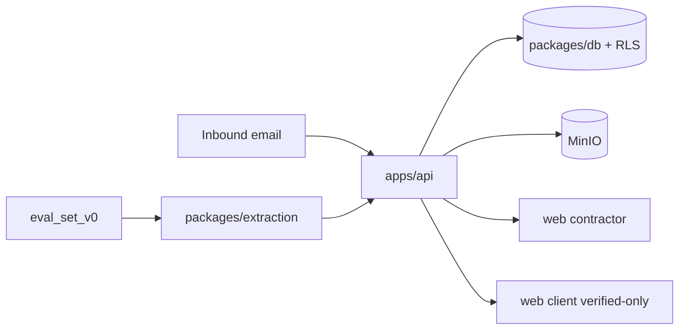

# EquiContracts

Converts routine construction-project email into structured, verified data.

**Contractors write** (project setup, email forwarding, field review).
**Clients and PMCs read** verified dashboards only.

**Start here:** [docs/plans/START_HERE.md](docs/plans/START_HERE.md) · handoff: [HANDOFF.md](HANDOFF.md) · docs index: [docs/README.md](docs/README.md) · workflow: [docs/WORKFLOW.md](docs/WORKFLOW.md).

Execution map: **[FLOW.md](FLOW.md)**. Orientation: **[docs/architecture/project-map.md](docs/architecture/project-map.md)**. Agents: **[docs/architecture/AGENTIC_DESIGN.md](docs/architecture/AGENTIC_DESIGN.md)**. Decisions: **[DECISIONS.md](DECISIONS.md)**.

---

## Module map — what lives where, what each part answers

| Location | Answers | Start here |
|----------|---------|------------|
| `specs/00-foundation/` | What Phase 0 must guarantee (EARS R-F1…R-F18) | `requirements.md` |
| `DECISIONS.md` | Why a boundary or library was chosen | Newest `D-0NN` |
| `docs/plans/` | Current step + master plan | `START_HERE.md`, then `MASTER_PLAN_v2.md` |
| `docs/architecture/` | System context, ER, agentic design | `project-map.md`, `AGENTIC_DESIGN.md` |
| `docs/prompts/` | Copy-paste step prompts | `README.md` |
| `docs/WORKFLOW.md` | How to work with the agent day to day | `docs/WORKFLOW.md` |
| `docs/domain/` | Indian contracting terms and dataset notes | `glossary.md` |
| `docs/security/` | Pre-launch security checklist | `pre-launch-checklist.md` |
| `docs/reference/` | Design photos / deck (local; client packs gitignored) | `app_photos/` |
| `packages/db/` | Schema, RLS, seed identities | `migrations/0002_rls.sql` |
| `apps/api/app/core/` | Auth, sessions, verification, storage, audit | `verification.py` |
| `apps/api/app/routers/` | HTTP entry points | `inbound.py`, `review.py`, `client_dashboard.py` |
| `apps/api/app/rules/` | Deterministic exceptions (no LLM) | `engine.py` + `definitions/` |
| `packages/extraction/` | BG extractor + eval harness | `bg_extractor.py`, `eval_harness.py` |
| `eval/` | Eval overview + frozen `eval_set_v0` | `README.md`, then `eval_set_v0/cases.json` |
| `apps/web/app/(contractor)/` | Setup + review UI (write path) | `setup/`, `review/` |
| `apps/web/app/(client)/` | Verified-only dashboard (read path) | `dashboard/` |
| `scripts/` + `.github/workflows/` | CI guardrails | `check_agent_rules.py` |
| `AGENTS.md` + `.cursor/rules/` | Non-negotiable coding laws | `AGENTS.md` |



---

## Required vs later (short)

| Phase 0 required shell | Later / designed |
|------------------------|------------------|
| RLS tenancy, HMAC email ingest, verification states, frozen eval, walking UI, BG extractor baseline | Full agents, money chain, payment mismatch, resolution generation |

There is no `Task.pdf` in-repo; the brief is START_HERE + EARS specs.

---

## Stack

| Layer | Technology |
|-------|------------|
| Database | Postgres 16 + RLS |
| API | FastAPI (Python 3.12 in CI) |
| Frontend | Next.js App Router |
| Object storage | MinIO (private bucket) |
| Extraction | BG reader wired; more types later |
| Rules | Deterministic YAML + pure Python |

---

## Run locally

```bash
cp .env.example .env
make install   # Python venv + web dependencies
make up        # Postgres + MinIO (Docker Desktop must be running)
make migrate
make verify    # target: under 60 seconds
```

Set `LLM_PROVIDER`, `LLM_MODEL`, and the matching API key slot before running extraction evals. See `.env.example`.
