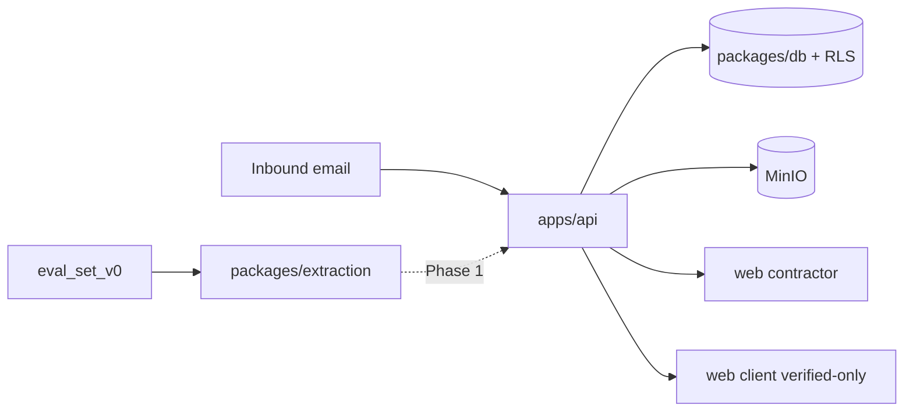

# EquiContracts

Converts routine construction-project email into structured, verified data.

**Contractors write** (project setup, email forwarding, field review).
**Clients and PMCs read** verified dashboards only.

**Start here:** [docs/plans/START_HERE.md](docs/plans/START_HERE.md) · handoff: [HANDOFF.md](HANDOFF.md) · workflow: [docs/WORKFLOW.md](docs/WORKFLOW.md).

Complete technical report (all HLD/LLD diagrams, every module and gate): **[BOOK.md](BOOK.md)**.
Execution map: **[FLOW.md](FLOW.md)**. Orientation: **[docs/architecture/project-map.md](docs/architecture/project-map.md)**.
Architecture: **[docs/architecture/HLD.md](docs/architecture/HLD.md)** · agents: **[docs/architecture/AGENTIC_DESIGN.md](docs/architecture/AGENTIC_DESIGN.md)**.

---

## Module map — what lives where, what each part answers

| Location | Answers | Start here |
|----------|---------|------------|
| `specs/00-foundation/` | What Phase 0 must guarantee (EARS R-F1…R-F18) | `requirements.md` |
| `specs/adr/` + `DECISIONS.md` | Why a boundary or library was chosen | Newest `D-0NN` |
| `docs/plans/` | Current step + master plan + phase build order | `START_HERE.md`, then `MASTER_PLAN_v2.md` |
| `docs/architecture/` | System context, ER, agentic design | `project-map.md`, `HLD.md` / `LLD.md`, `AGENTIC_DESIGN.md` |
| `docs/prompts/` | Copy-paste step prompts for new chats | `README.md` |
| `docs/WORKFLOW.md` | How to work with the agent day to day | `docs/WORKFLOW.md` |
| `docs/domain/` | Indian contracting terms and dataset notes | `glossary.md` |
| `docs/security/` | Pre-launch security checklist mapped to this stack | `pre-launch-checklist.md` |
| `docs/reference/` | Design photos / deck (local; client packs gitignored) | `app_photos/` |
| `packages/db/` | Schema, RLS, seed identities | `migrations/0002_rls.sql` |
| `apps/api/app/core/` | Auth, sessions, verification, storage, audit | `verification.py` |
| `apps/api/app/routers/` | HTTP entry points | `inbound.py`, `review.py`, `client_dashboard.py` |
| `apps/api/app/rules/` | Deterministic exceptions (no LLM) | `engine.py` + `definitions/` |
| `packages/extraction/` | Classify/extract (Phase 1) + eval harness (Phase 0) | `eval_harness.py` |
| `eval/eval_set_v0/` | Frozen gold labels (documents not in git) | `cases.json` |
| `apps/web/app/(contractor)/` | Setup + review UI (write path) | `setup/`, `review/` |
| `apps/web/app/(client)/` | Verified-only dashboard (read path) | `dashboard/` |
| `scripts/` + `.github/workflows/` | CI guardrails agents cannot shrug off | `check_agent_rules.py` |
| `AGENTS.md` + `.cursor/rules/` | Non-negotiable coding laws | `AGENTS.md` |



---

## Required vs later (short)

| Phase 0 required shell | Later / designed |
|------------------------|------------------|
| RLS tenancy, HMAC email ingest, verification states, frozen eval, walking UI | Live vision/structured extractors, full BG/milestone rules, payment mismatch (Ph 4), resolution generation (Ph 5) |

See BOOK.md Chapter 0 for the full brief / extensions / research split. There is no `Task.pdf` in-repo; the brief is the phase plan + EARS specs.

---

## Stack

| Layer | Technology |
|-------|------------|
| Database | Postgres 16 + RLS |
| API | FastAPI (Python 3.12) |
| Frontend | Next.js App Router |
| Object storage | MinIO (private bucket) |
| Extraction | Vision + structured parsers (wired in Phase 1) |
| Rules | Deterministic YAML + pure Python |

---

## Run locally

```bash
cp .env.example .env
make install   # Python venv + web dependencies
make up        # Postgres 16 + MinIO
make reset     # migrations + seed
make dev       # API :8000 + web :3000
make verify    # rules + lint + typecheck + tests (target < 60s)
```

Prerequisites: Docker, Python 3.12, Node 20+, npm.

---

## Critical invariants

- No tenant query without org scoping (`FORCE` RLS)
- No `float` for money — `Decimal` / `numeric(18,2)` only
- Financial fields cannot reach `verified` without `verified_by`
- Rules engine never calls an LLM
- `(client)` routes expose verified data only
- Never modify existing files under `eval/eval_set_v0/expected/`

Full list: `AGENTS.md`.
