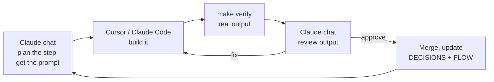
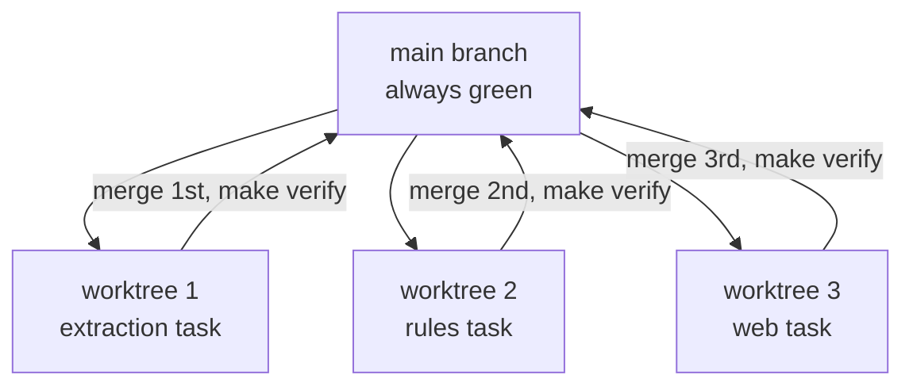

# How We Work: Cursor, Claude Code, and the Claude Chat

_Related:_ phase gates and current steps live in `docs/plans/START_HERE.md`. Day-to-day agent workflow is this file.

The day-to-day workflow. Read once, then use the checklists.

---

## 1. Three tools, three jobs

| Tool | Use it for | Don't use it for |
|---|---|---|
| **Claude chat** (claude.ai) | Planning, understanding concepts, deciding, reviewing results, writing the next prompt | Running code |
| **Cursor** | Most coding. UI work (you see changes immediately). Small, focused tasks. | Big multi-file refactors without a plan |
| **Claude Code** (terminal) | Multi-file backend work, migrations, running `make verify`, long tasks | Pixel-level UI tweaks |

The loop:



## 2. Cursor modes, when to use which

| Mode | What it does | Use it when |
|---|---|---|
| **Ask** | Reads code, answers, changes nothing | "What does this file do?" "Where is X?" |
| **Plan** | Writes a plan, changes nothing | Before any task touching 3+ files. Read the plan, then switch to Agent. |
| **Agent** | Edits files, runs commands | The actual build, after you've approved the plan |

**Rule:** for anything bigger than one file, run Plan first, read it, then Agent.

## 3. Rule files (already set up by the kit)

| File | Read by | Purpose |
|---|---|---|
| `AGENTS.md` | Cursor Agent mode | The main rules. Keep short. |
| `CLAUDE.md` | Claude Code | Symlink to AGENTS.md, so both tools read the same rules |
| `.cursor/rules/*.mdc` | Cursor | Folder-specific rules that load only when that folder is edited |

**Never create `.cursorrules`.** Cursor Agent mode ignores it.

Rules in text are advisory. Agents read them and still drift. The rules that matter are also enforced by `scripts/check_agent_rules.py` in CI.

## 4. How to brief an agent (the template)

Every prompt to Cursor or Claude Code follows this shape. The prompts in `docs/prompts/` already do.

```
Task: <one sentence>

Read first: <spec / plan file> and <existing file to copy the pattern from>

Do:
1. ...
2. ...

Only touch: <folders>
Do not touch: <folders>

Done when:
- <test or check>
- make verify passes

Stop and show me: <real output / diff> before anything else.
Log: append to DECISIONS.md if you chose between options; update FLOW.md if
you added a call path.
```

**Good task size:** one feature, 1 to 5 files, finishable in one session.
- Too big: "Build BG Verify"
- Right: "Add the claim expiry rule following the pattern in rules/definitions/bg_expiry.yaml"

## 5. Running agents in parallel

Allowed when tasks touch **different folders**. Max **3** at once.



- Each parallel task gets its own **git worktree** (Claude Code: `claude --worktree`; Cursor: open the worktree folder as its own window)
- **Only one agent touches migrations at a time.** Worktrees separate files, not your database.
- Merge **one at a time**, `make verify` after each. Batched merges make breakages untraceable.
- Never run `make verify` from two agents at the same moment against the same DB

## 6. Reviewing what an agent did

Before merging anything, check:

- [ ] `make verify` green, and you saw the real output
- [ ] Only the folders it was allowed to touch changed (`git diff --stat`)
- [ ] No tests skipped, deleted, or weakened
- [ ] Nothing changed under `eval/eval_set_v0/`
- [ ] No migration edited (only new ones added)
- [ ] Money uses Decimal, never float
- [ ] No document contents or names in logs
- [ ] DECISIONS.md updated if it chose between options
- [ ] FLOW.md updated if it added a new path
- [ ] You can explain in one sentence what changed

If something looks off, paste it into the Claude chat before merging.

## 7. Daily routine

**Start of day**
1. `git pull`, `make up`, `make verify`
2. Open `docs/plans/START_HERE.md`, find the current step
3. Run the quick status prompt (section 9) if you've lost the thread

**During**
4. Take the step's prompt from `docs/prompts/`
5. Plan mode → read → Agent mode
6. Review with the checklist above

**End of day**
7. Everything merged is green on main
8. `git worktree prune`
9. One line in `FLOW.md` session log: what changed

## 8. When to come back to the Claude chat

- Before starting a new step (get the prompt, confirm the plan)
- When a test fails and the fix would change a test, a migration, or a security rule
- When an agent asks a question you're unsure about
- When the co-founder answers something that changes a rule or the plan
- After every phase gate

## 9. Status prompts

**Quick (daily):**
```
Quick status, no code changes:
1. Which step of docs/plans/START_HERE.md are we on, based on the actual code?
2. Run make verify and give me the real pass/fail count.
3. List uncommitted or unmerged work.
4. One paragraph: what should I do next and why.
```

**Full audit (weekly or when lost):** use `docs/prompts/audit.md`.

## 10. Folder map

```
AGENTS.md, CLAUDE.md        rules for coding agents
DECISIONS.md                every decision and why (append only)
FLOW.md                     entry points, call paths, session log
HANDOFF.md                  state summary for new chats
docs/plans/                 START_HERE, master plan, phase plans
docs/architecture/          agentic design, HLD, LLD
docs/prompts/               ready-to-paste prompts, one per step
docs/WORKFLOW.md            this file
.cursor/rules/              folder-specific rules
apps/api/                   FastAPI backend
apps/web/                   Next.js website
packages/db/migrations/     database changes, never edited after applied
packages/extraction/        document reading
packages/agents/            agent runtime, tools, agents (from Step 4)
eval/eval_set_v0/           frozen real-document tests
scripts/                    CI rule checker and helpers
```
