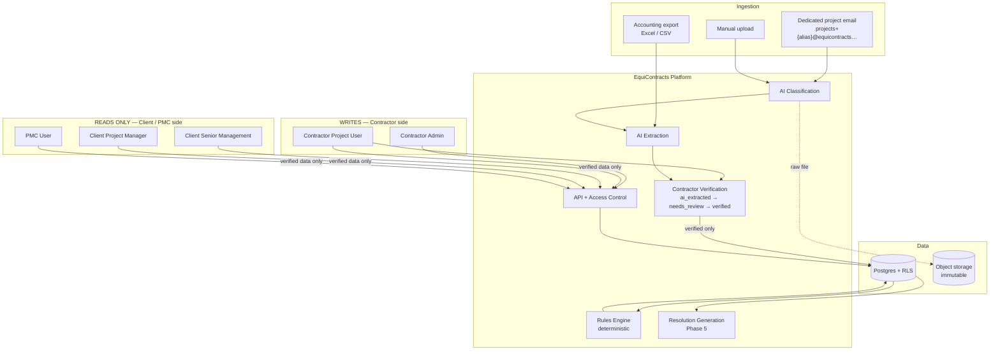
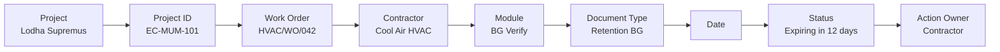
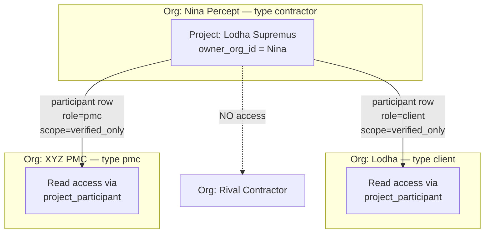
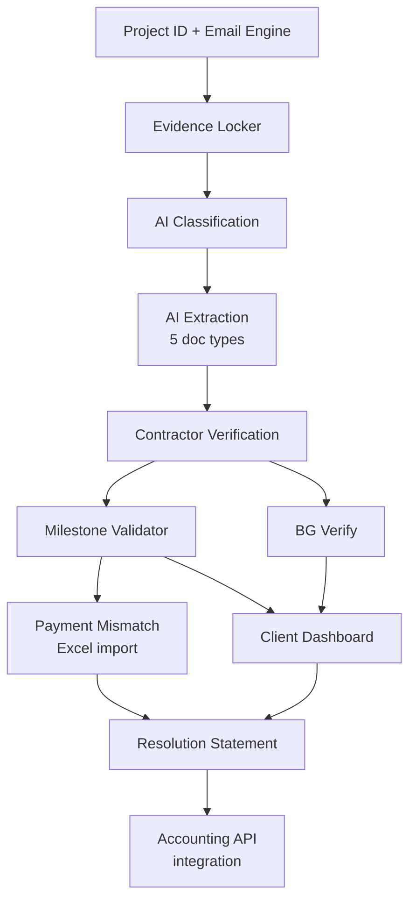
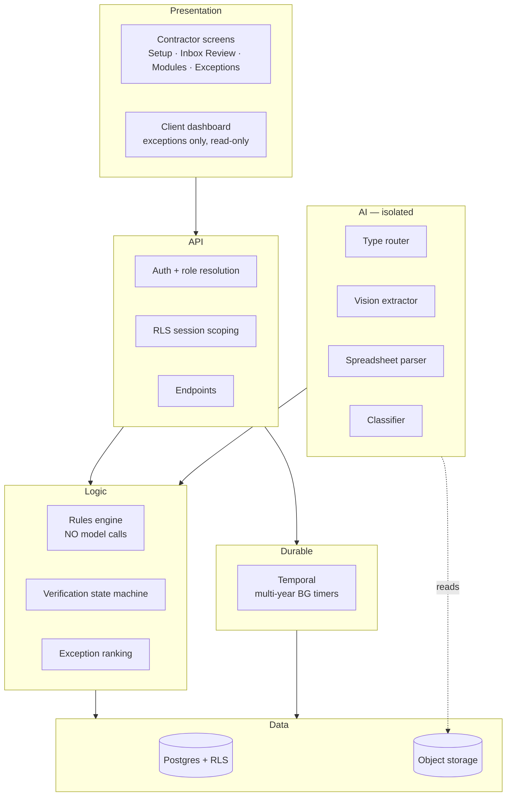
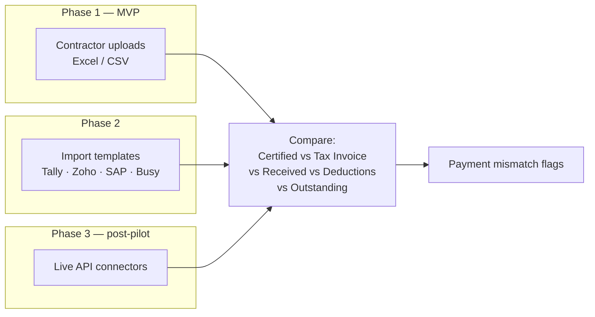

# EquiContracts — High Level Design

> **Product principle:** Contractor feeds. Client sees. Platform structures, verifies and surfaces exceptions.
>
> The Client must never become a data-entry user. The Contractor must never feel they are
> filling in another ERP. The platform quietly converts routine project communication into
> structured dashboards.

---

## 1. System context

Note the asymmetry: the contractor writes, the client and PMC only read. This is the whole
product thesis expressed as an access model.

**The single most important edge in this diagram** is `REVIEW -->|verified only| PG`.
Unverified AI output never reaches a client-facing dashboard. That constraint is what makes
the platform credible to both sides at once: the client trusts the numbers because the
contractor confirmed them, and the contractor accepts the dashboard because it is built
from their own submissions.

---

## 2. Master data backbone

Every record in the system resolves to this chain. If a record can't be placed on it,
the record is malformed.

`action_owner` defaults to the Contractor on every exception — the contractor is the party
who feeds the platform, so they are the party who resolves gaps. Client and PMC values
exist for the cases where the blockage genuinely sits with them (certification ageing being
the obvious one), and those cases are exactly what the client dashboard needs to surface
honestly.

---

## 3. Access model

This is the part my earlier plan got wrong, and it is worth understanding before writing
the RLS policy.

Three access rules the schema must enforce:

1. A contractor sees **only their own** projects. Never another contractor's, even on the
   same client's site.
2. A client sees **verified data only**, across all contractors on their projects.
3. Internal contractor notes are never visible to the client, regardless of role.

Rule 1 is the existential one. Two subcontractors on the same tower seeing each other's
rates ends the business.

---

## 4. Module dependency order

Modules are built in dependency order, not importance order. Each one needs the one before it.

Resolution Statement sits last because it is only as good as the project memory beneath it.
Built early, it produces confident, thinly-sourced narratives — which is worse than nothing
in a dispute.

---

## 5. Layer architecture

`L4` connects to `L3`, never directly to `L1` or `L6`. AI output must pass through the
verification state machine to become data. That is enforced by a CI check asserting no
model imports in the rules layer, and by the DB constraint on verification state.

---

## 6. Accounting integration, phased

Deliberately not an API integration on day one.

Building live Tally/SAP connectors before pilot validation is the classic way to spend three
months on plumbing for a workflow nobody has confirmed they want.
