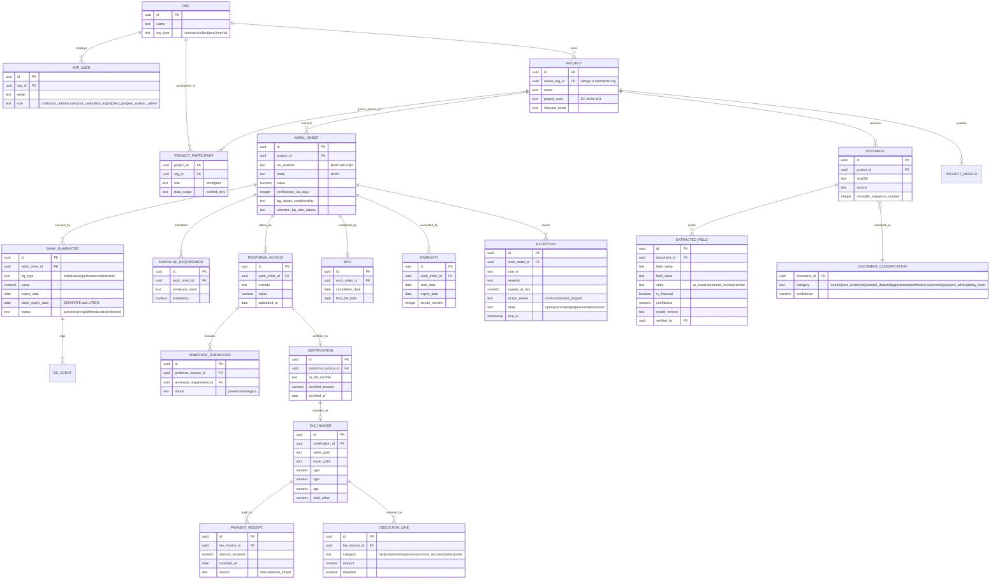
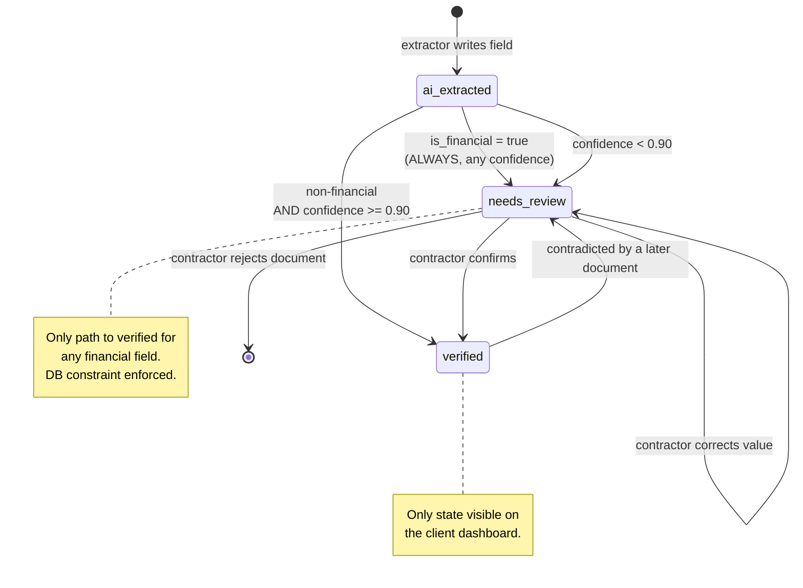
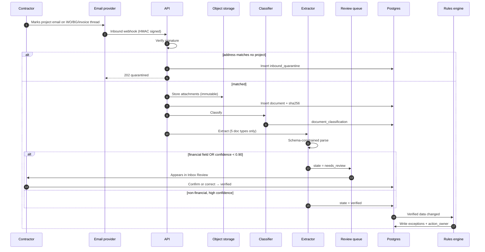
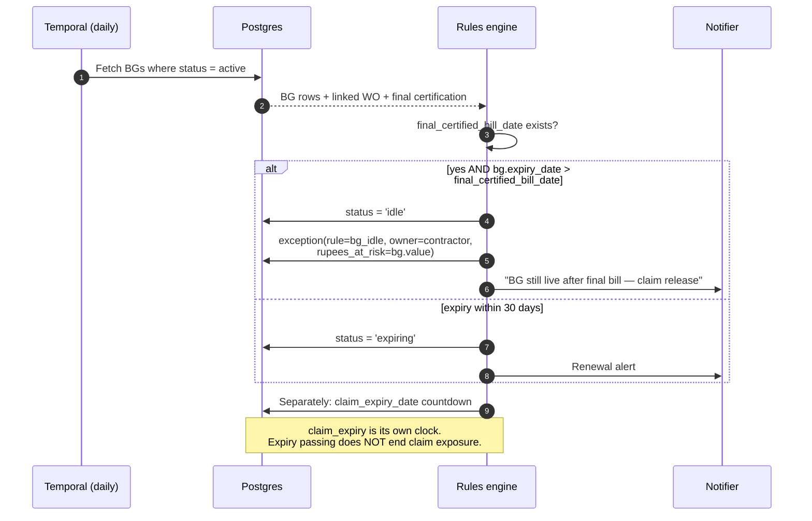
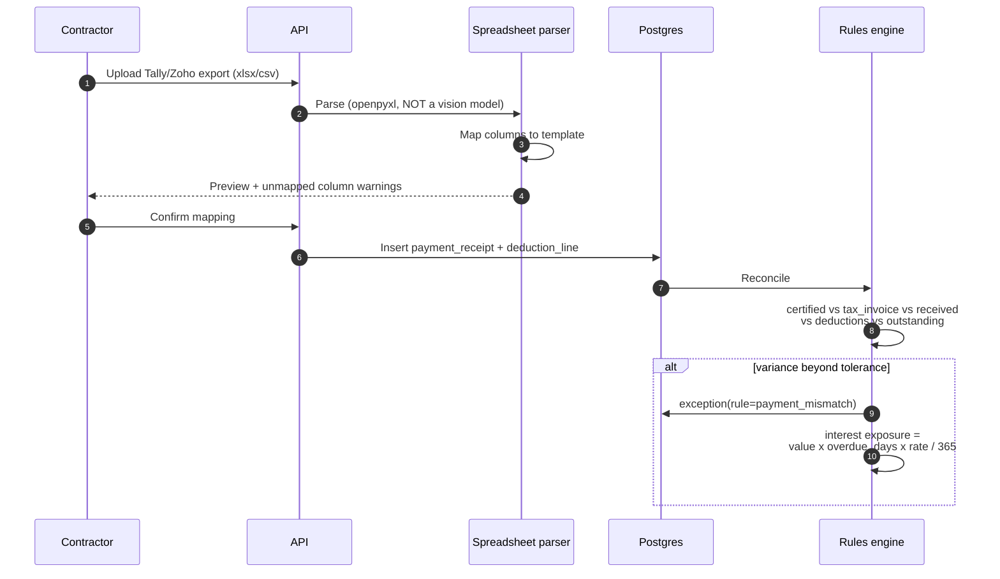
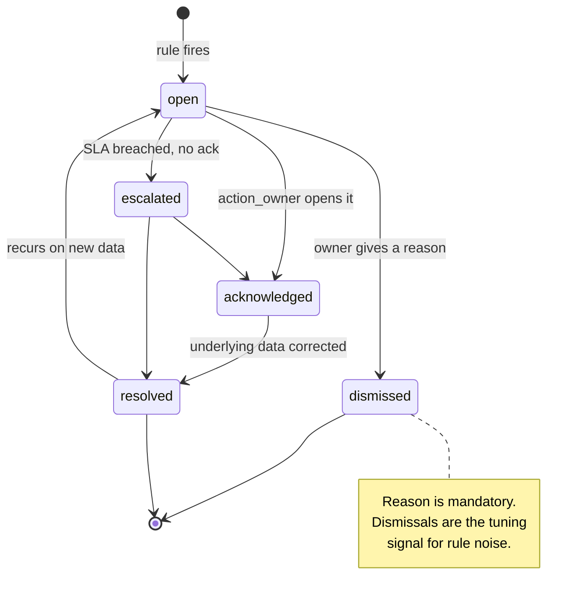
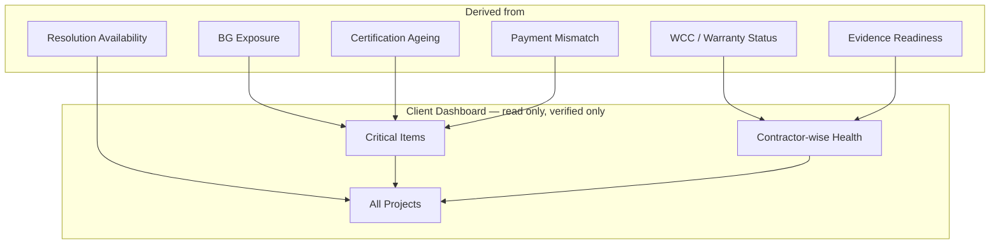

# EquiContracts — Low Level Design

---

## 1. Entity relationship

Corrected for dual-sided access: `org` now carries a type, and `project_participant` grants
client/PMC read access without making them tenants of the contractor's data.

---

## 2. Verification state machine

Three states, from the product spec. The boolean I originally proposed can't express
"AI extracted but not yet flagged for review", which matters for confident non-financial
fields.

The `verified --> needs_review` transition matters and is easy to forget: if a corrected
BG amendment arrives later, the previously verified value must be pulled back for
re-confirmation rather than silently overwritten.

---

## 3. Sequence — email ingestion to verified field

Step ordering matters at the signature check: verify before doing anything else. An
unsigned inbound endpoint is an open door for injecting forged documents into any
contractor's project.

---

## 4. Sequence — idle BG detection

This is a rule worth showing in full because the founder spec defines it precisely and it's
non-obvious: a BG is *idle* when the work is finished but the guarantee is still live and
still costing bank commission.

---

## 5. Sequence — payment mismatch via Excel import

Spreadsheets go through a structured parser, never a vision model. The real reconciliation
files are genuine xlsx with formulas — sending them to a vision model costs more and loses
precision that's already available for free.

---

## 6. Exception lifecycle

---

## 7. Module composition on the client dashboard

Status vocabulary, fixed across the whole product so the two sides never argue about what a
label means: `healthy`, `critical`, `needs_verification`, `pending_contractor`,
`pending_client_pmc`, `resolved`.

That `pending_client_pmc` value is doing quiet diplomatic work — it lets the platform state
that a delay sits with the client without editorialising, because the certification clock
is simply a fact derived from the WO's own SLA.
