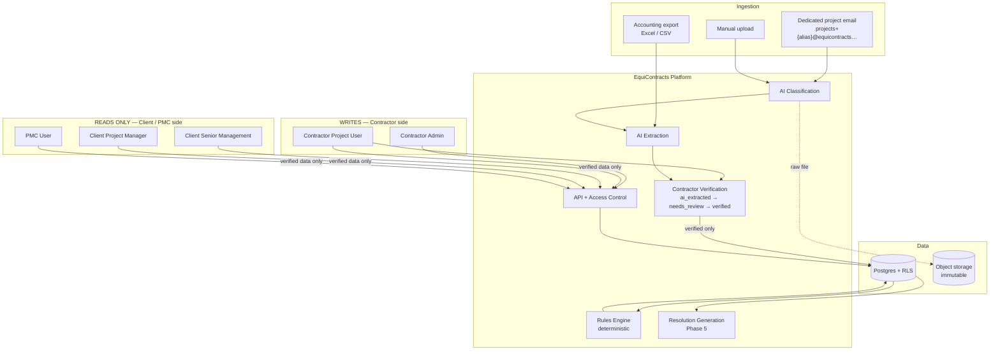
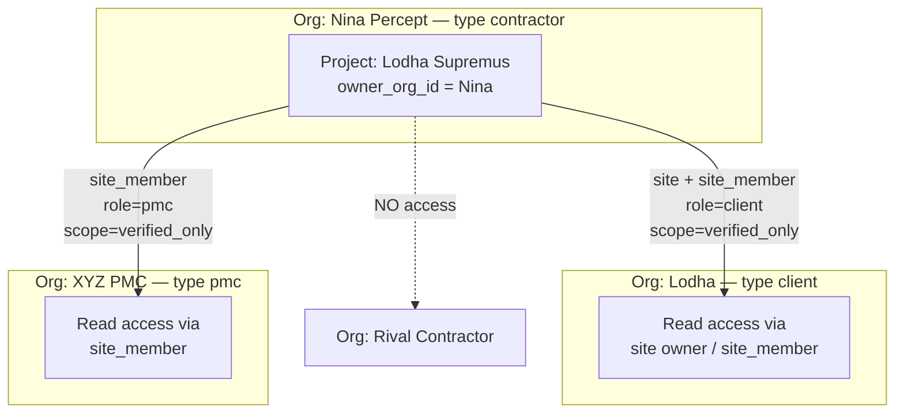
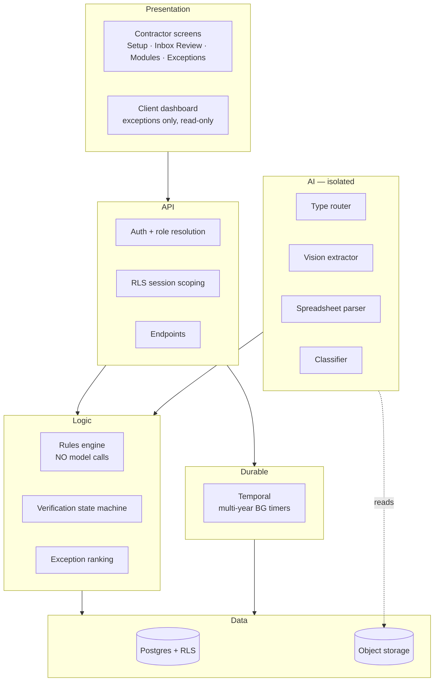
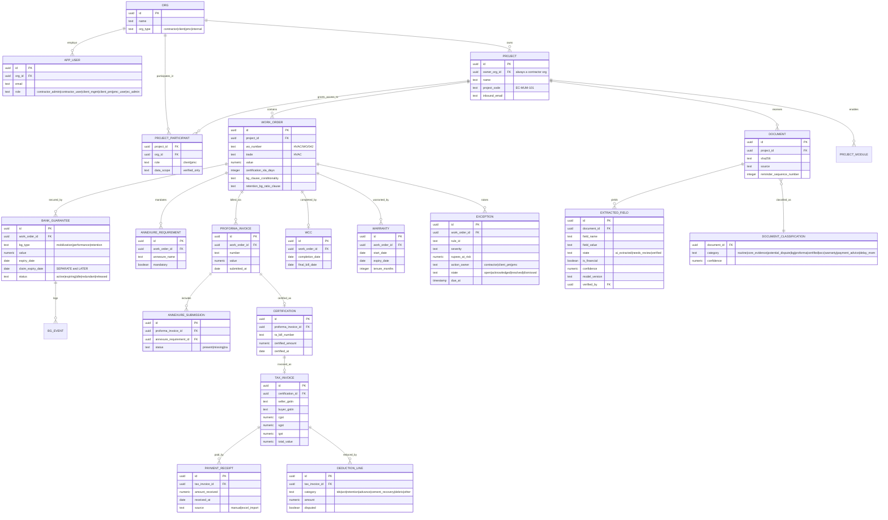
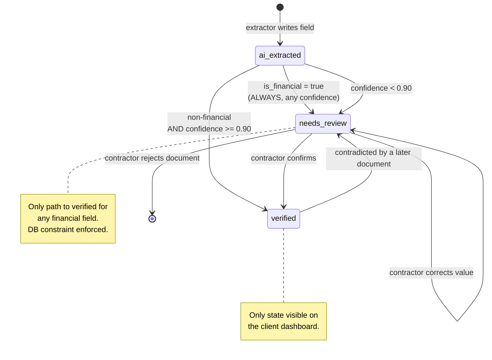
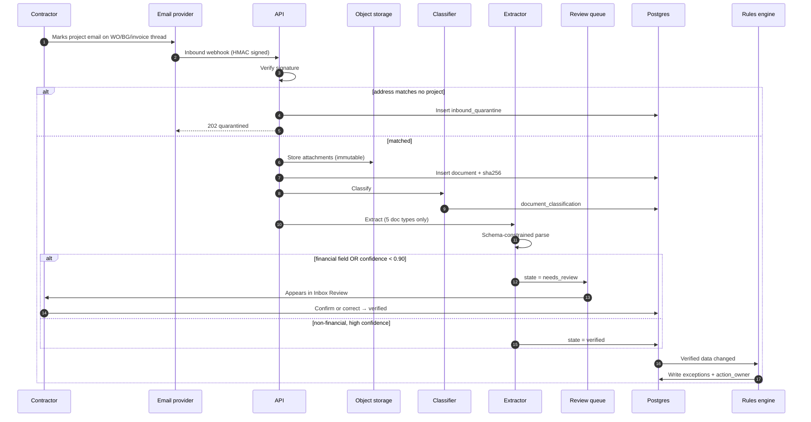

# The Complete Project Map

Everything the system does, where it lives, and how the pieces connect. Read this when
you've lost the thread. Living companion docs: [FLOW.md](../../FLOW.md),
[DECISIONS.md](../../DECISIONS.md), [AGENTIC_DESIGN.md](./AGENTIC_DESIGN.md).

---

## Part 1 — What the product is, in four sentences

An Indian construction contractor signs work orders with clients, gives them bank guarantees
as security, submits bills, and waits to get paid. All of that lives in scattered emails,
WhatsApp threads, and spreadsheets, so guarantees lapse unnoticed, bills sit uncertified
for weeks, and disputes turn into "he said, she said."

EquiContracts gives each contractor one inbox to forward everything to. AI reads the
documents, a human confirms anything involving money, and then plain deterministic rules
watch every date and amount and tell the right person what needs attention today. The client
and PMC see the same confirmed data — which is what makes the dashboard accepted rather than
argued.

---

## Part 2 — The six modules

| Module | What it answers | Phase |
|---|---|---|
| **Project Setup** | "Where do I send my documents?" | 0 |
| **Evidence Locker** | "Where is that email from March?" | 3 |
| **BG Verify** | "Which guarantees are about to lapse or are sitting idle?" | 1 |
| **Milestone Validator** | "Where is my money stuck, and why?" | 2 |
| **Payment Mismatch** | "Did they actually pay what they certified?" | 4 |
| **Resolution Statement** | "Prove what happened, with citations." | 5 |

Plus two views over the above: **Contractor Exceptions** (what needs my action) and
**Client Dashboard** (read-only, verified data only).

Phase plans: [`docs/plans/`](../plans/).

---

## Part 3 — The layers, and what each is responsible for

```
┌────────────────────────────────────────────────┐
│ 1. WEB — what people see                       │
│    (contractor) writes · (client) reads only    │
├────────────────────────────────────────────────┤
│ 2. API — routes, auth, permission enforcement   │
├────────────────────────────────────────────────┤
│ 3. RULES — deterministic. Zero AI. Ever.        │
├────────────────────────────────────────────────┤
│ 4. EXTRACTION — AI reads documents (isolated)   │
├────────────────────────────────────────────────┤
│ 5. DATA — Postgres (RLS) + S3 (immutable files) │
└────────────────────────────────────────────────┘
```

**The rule that makes this coherent:** layer 4 (AI) never writes to layer 5 (domain data)
directly. It writes *proposals* into `extracted_field`, a human confirms them, and only then
does a promotion step create the real `bank_guarantee` record. This is why layer 3 can be
purely deterministic — by the time rules run, everything they read has been confirmed.

---

## Part 4 — Every file that matters, and what it does

### `packages/db/migrations/` — the database blueprint

| File | Creates | Why it matters |
|---|---|---|
| `0001_orgs_and_access.sql` | `org`, `app_user`, `project`, `project_participant`, `project_module` | Original tenancy foundation (renamed in 0009). |
| `0002_rls.sql` | Policies and helpers (`can_read_project`, `owns_project`) | Original RLS (helpers replaced in 0009). |
| `0003_documents_extraction.sql` | `document`, `document_classification`, `extracted_field`, `inbound_quarantine`, `event_log` | Documents and the AI-output-awaiting-confirmation layer. |
| `0004_work_orders_annexures.sql` | `work_order`, `annexure_requirement`, `proforma_invoice`, `annexure_submission` | Contracts and their required-document checklists. |
| `0005_bg_verify.sql` | `bank_guarantee`, `bg_event` | Guarantees with the dual-date constraint. |
| `0006_milestone_chain.sql` | *(stub — Phase 2)* | Certification, payment, WCC, warranty. |
| `0007_document_participant_read.sql` | Alters document-chain SELECT policies | Participants can read documents for dashboard joins; writes stay owner-only. |
| `0008_inbound_alias.sql` | Renames `inbound_email` → `inbound_alias`; updates resolve fn | Shared inbox plus-addressing (`projects+{alias}@domain`). |
| `0009_site_engagement_and_quarantine.sql` | `site`, `site_member`; rename `project`→`engagement`, `project_module`→`engagement_module`; `project_id`→`engagement_id`; `owns_engagement` / `can_read_engagement`; `link_engagement_to_site`; lock `inbound_quarantine` | **Current tenancy model (D-026/D-033).** Client/PMC read via site; contractors stay isolated; no `FOR ALL` policies. |
| `0010_agent_foundation.sql` | `event`, `agent_run`, `agent_step`, `agent_proposal`, `review_decision`; `equicontracts_agent`; `claim_next_event` | **Agent foundation (D-034).** Worker claims cross-org; runs are org-scoped; proposal state only via `review_decision` trigger. |
| *(future)* `exceptions` / resolution tables | Phase 1+ | Needs-attention flags and later domain tables. |

**The two constraints worth knowing by name:**

```sql
financial_requires_human_verification
  -- a money field cannot be marked verified without a named human

bg_claim_expiry_after_expiry
  -- claim expiry must be on or after expiry (they're different dates)
```

### `apps/api/app/core/` — the plumbing

| File | What it does |
|---|---|
| `config.py` | Reads every setting from environment variables. No secrets in code. |
| `db.py` | **Four** session types: `org_scoped_session` (app), `agent_org_scoped_session` (worker), `privileged_session` (system inbound), `provisioning_session` (admin org create). |
| `auth.py` | Figures out who's making a request. **Currently a header stub — must be real auth before deployment.** |
| `storage.py` | Puts files in S3 with content-addressed keys, generates 5-minute signed URLs. Bucket is never public. |
| `financial_fields.py` | The list of fields that always need human confirmation. Deliberately over-inclusive — a false positive costs 10 seconds of review, a false negative commits a wrong BG expiry. |
| `verification.py` | The three-state machine: `ai_extracted` → `needs_review` → `verified`. Every transition in one testable place. |
| `event_log.py` | Hash-chained audit trail. Each entry includes the previous entry's hash, so tampering is detectable. |
| `project_code.py` | Generates project codes and inbound aliases (`inbound_alias_for`, `display_inbound_address`). |

### `apps/api/app/routers/` — the endpoints

| File | Handles | Status |
|---|---|---|
| `projects.py` | Create project, list, module toggles | Built |
| `inbound.py` | Receives forwarded email. **HMAC verified first** — the only publicly-reachable endpoint. Plus-alias routing. | Built |
| `review.py` | The contractor's confirmation queue | Built |
| `client_dashboard.py` | Read-only client view | Built |
| `bg.py` | BG list, audit, savings | Phase 1 |
| `milestones.py` | The four tabs | Phase 2 |
| `exceptions.py` | What needs attention | Phase 1 |
| `imports.py` | Excel/CSV payment upload | Phase 4 |
| `advisor.py` | Resolution Statement | Phase 5 |

### `apps/api/app/rules/` — the deterministic logic

`engine.py` loads YAML rule definitions and evaluates them. Each rule is a data file, not
code, so thresholds are tunable per customer without touching Python.

Every rule needs: `id`, `when`, `severity`, `evidence_query`, `action_owner`,
`autonomy_tier`.

**This directory contains zero AI calls, enforced by CI.** A bank guarantee expiry alert must
give the same answer every time, forever.

### `packages/agents/` — runtime, guardrails, tools, agents (D-035)

No SQL or repository imports (CI-enforced). Worker in `apps/api/app/workers/`
claims events and passes an opaque services handle into `RunContext`.

| Path | Role |
|---|---|
| `router.py` | `event_type` → agent name list (unknown → fail) |
| `runtime.py` | steps / retries / cost; `emit_proposal` looks up autonomy |
| `guardrails/` | allowlist, autonomy ladder, Indian number check |
| `tools/` | `get_engagement_context`, `read_document_metadata` (engagement-pinned) |
| `agents/echo/` | Deterministic stub: tool read + one `echo.note` proposal |

### `packages/extraction/` — the AI layer

| File | What it does |
|---|---|
| `router.py` | Dispatches by file type: xlsx → structured parser, PDF/image → vision model |
| `vision_extractor.py` | Frontier model with schema-constrained JSON output |
| `structured_extractor.py` | `openpyxl` for real spreadsheets — cheaper and more precise than vision on structured data |
| `classifier.py` | Sorts email into the 10 categories |
| `confidence.py` | Decides auto-commit vs review queue |
| `eval_harness.py` | Scores extraction against the 11 real documents. Reports financial and non-financial accuracy **separately** — an aggregate hides regressions in exactly the fields that cost money. |

### `eval/eval_set_v0/` — the frozen truth

Eleven real historical documents with hand-verified expected answers. **CI blocks any
modification.** If an extraction test fails, the extractor is wrong — not the fixture.

Currently 2 of 11 transcribed.

---

## Part 5 — The five flows that matter

### Flow 1 — A document arrives

```
Contractor forwards email
  → /inbound/email verifies HMAC signature FIRST
  → parse projects+{alias}@domain; no '+' → quarantine, never guess
  → resolve project by inbound_alias
  → store file in S3, compute SHA-256 ourselves
  → create document row
  → classify (routine / core evidence / potential dispute)   [Phase 1+]
  → extract fields by document type                          [Phase 1+]
  → financial field OR low confidence? → needs_review
  → otherwise → verified
```

### Flow 2 — A human confirms

```
Contractor opens review queue
  → sees field, confidence, source document
  → confirms → state = verified
  → corrects → NEW row created, old one marked superseded
     (both survive — that pairing is your training data)
  → promotion step creates the real domain record
  → rules re-evaluate
```

### Flow 3 — Rules find a problem

```
Scheduled sweep, or triggered by new verified data
  → load YAML rule definitions
  → run each rule's evidence query
  → condition met? create/update exception
  → assign action_owner (default: contractor)
  → rank by ₹ at risk × urgency
  → notify above severity threshold
```

### Flow 4 — Contractor sees what needs action

```
Exceptions ranked by money at risk
  → drafted action attached where possible
  → one click to act, not compose from scratch
```

### Flow 5 — Client checks in

```
Client dashboard
  → projects via project_participant (read policy)
  → VERIFIED data only
  → aggregate: healthy / critical / needs verification /
    pending contractor / pending client-PMC / resolved
  → no raw documents, no internal contractor notes
```

---

## Part 6 — The design decisions, and why

| Decision | Why |
|---|---|
| Postgres RLS, forced | A forgotten `WHERE` clause is a company-ending leak. The database enforces it, so it holds even when code is wrong. |
| Three verification states | A boolean can't express "confident but unreviewed." |
| Financial fields never auto-commit | A wrong BG expiry costs unrecoverable money. Enforced as a DB constraint, not a policy. |
| BG has two dates | Real data: 366 days apart. A single-date model silently discards a year of live exposure. |
| Rules have zero AI | Same input must always give the same answer for anything affecting money. |
| Extraction never writes domain tables | Keeps unconfirmed AI output off dashboards entirely. |
| `numeric`/`Decimal`, never float | Floating point can't represent decimal fractions exactly. Errors compound across thousands of transactions. |
| Content-addressed storage + own hash | Proof of exactly what was received, defensible in a dispute. |
| Private bucket + signed URLs | A public bucket of bank guarantees is the worst-case incident. |
| Eval set frozen in CI | Agents "fix" failing tests by editing expectations. That silently destroys your only quality measure. |
| Email-first, not WhatsApp | Personal WhatsApp scraping is a ToS violation and legal exposure. |
| Shared inbox + plus-addressing | One mailbox to operate; alias survives provider delivery (manual forwards may strip `+`). |
| Excel import before accounting APIs | Three months of connector plumbing before validating the workflow is the classic mistake. |

Canonical decision log: [DECISIONS.md](../../DECISIONS.md).

---

## Part 7 — Current state and the path forward

**Done (code):** schema through BG tables · site/engagement + locked quarantine (0009) ·
agent foundation schema (0010) · agent runtime/guardrails/echo + worker `run_once`
(D-034/D-035) · RLS · API core · four routers on services/repositories · walking
web skeleton · CI guardrails · rule engine loader · plus-address inbound · BG
extractor with provider-selectable LLM settings · GECPL eval baseline 4/4
(`gemini-2.5-flash`) · FLOW/DECISIONS living docs.

**Not built yet:** real agents (Intake/Extraction/…) · LLM inside runtime ·
LangGraph · promotion beyond extractor rows · real auth (header stub remains) ·
Tracks B/C · web rename away from `/projects`.

**Immediate path:** follow [START_HERE.md](../plans/START_HERE.md) steps 2→10.
Step 1 (BG extractor baseline) is done. Step 5 Part B (echo runtime) is done.

**Before any public deployment:** replace the auth stub (Step 10). Full checklist:
[docs/security/pre-launch-checklist.md](../security/pre-launch-checklist.md).

---

## Part 8 — Architecture diagrams (from former HLD / LLD)

Essential system diagrams live here so agents do not need separate HLD/LLD files.


### From HLD

## 1. System context

Note the asymmetry: the contractor writes, the client and PMC only read. This is the whole
product thesis expressed as an access model.



**The single most important edge in this diagram** is `REVIEW -->|verified only| PG`.
Unverified AI output never reaches a client-facing dashboard. That constraint is what makes
the platform credible to both sides at once: the client trusts the numbers because the
contractor confirmed them, and the contractor accepts the dashboard because it is built
from their own submissions.

---

## 3. Access model

This is the part my earlier plan got wrong, and it is worth understanding before writing
the RLS policy.



Three access rules the schema must enforce:

1. A contractor sees **only their own** engagements. Never another contractor's, even on
   the same client's site.
2. A client sees **verified data only**, across all contractors on sites they own or join.
3. Internal contractor notes are never visible to the client, regardless of role.

Rule 1 is the existential one. Two subcontractors on the same tower seeing each other's
rates ends the business.

---

## 5. Layer architecture



`L4` connects to `L3`, never directly to `L1` or `L6`. AI output must pass through the
verification state machine to become data. That is enforced by a CI check asserting no
model imports in the rules layer, and by the DB constraint on verification state.

---

### From LLD

## 1. Entity relationship

Corrected for dual-sided access: `org` now carries a type, and `project_participant` grants
client/PMC read access without making them tenants of the contractor's data.



---

## 2. Verification state machine

Three states, from the product spec. The boolean I originally proposed can't express
"AI extracted but not yet flagged for review", which matters for confident non-financial
fields.



The `verified --> needs_review` transition matters and is easy to forget: if a corrected
BG amendment arrives later, the previously verified value must be pulled back for
re-confirmation rather than silently overwritten.

---

## 3. Sequence — email ingestion to verified field



Step ordering matters at the signature check: verify before doing anything else. An
unsigned inbound endpoint is an open door for injecting forged documents into any
contractor's project.

---
