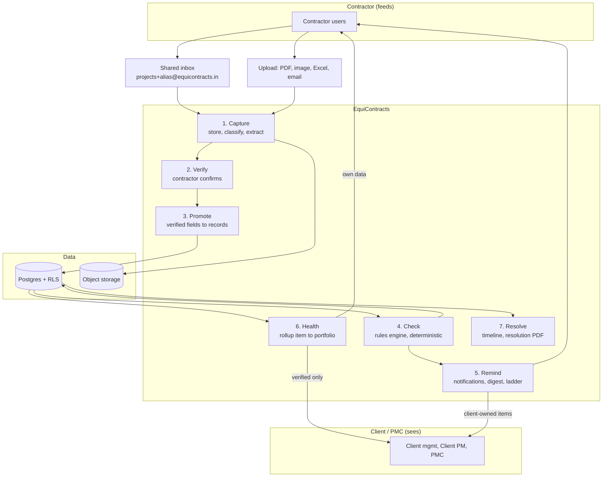
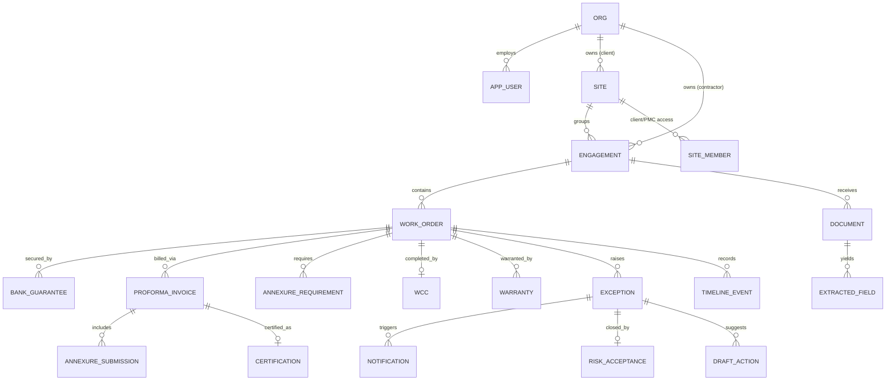
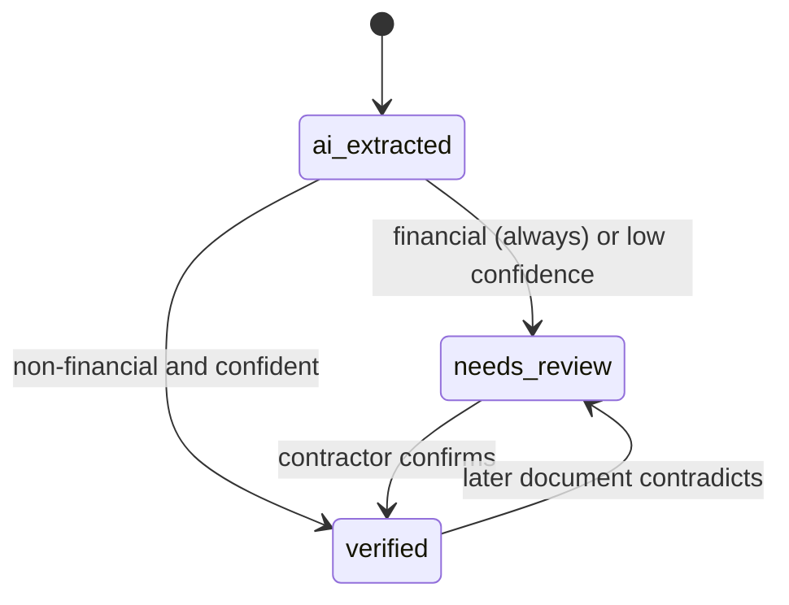
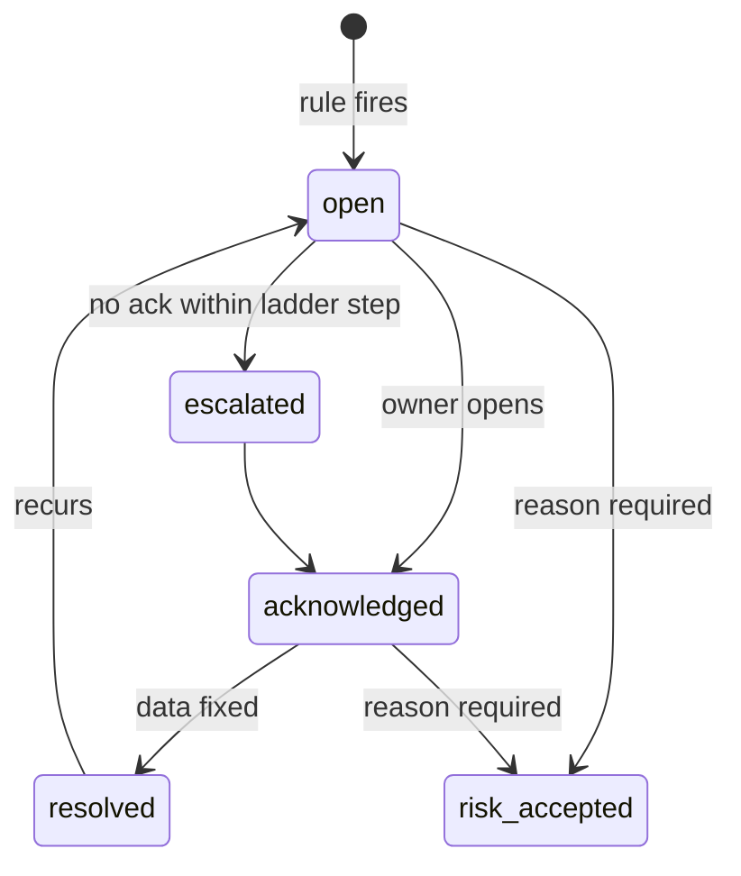
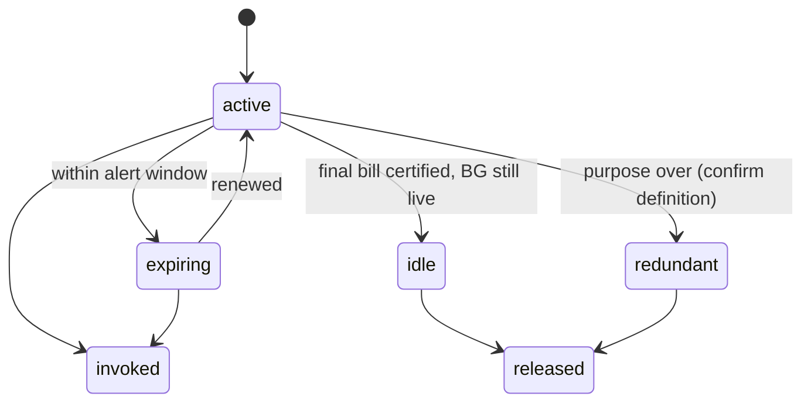
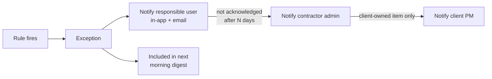

# EquiContracts: Master Plan v2

Rebuilt from three sources:
- Your explanation of why we are building this
- All 22 app screens (contractor and client)
- The 15-slide product deck

This replaces MASTER_PLAN.md. Where they disagree, this one wins.

---

# Part 1: Why we are building this

## The four problems

A contractor runs many projects at once. Each project produces work orders, bank guarantees, bills, certificates, warranties, and hundreds of emails. Four things go wrong.

| # | Problem | What it costs |
|---|---|---|
| 1 | **Documents are scattered.** Email, WhatsApp, laptops, someone's drawer. Nothing is in one place. | Cannot find proof when a dispute starts. "He said, she said." |
| 2 | **Nobody is reminded.** BG expiry, claim expiry, warranty end, certification deadlines all pass silently. | Lapsed guarantees, blocked money, missed claims. |
| 3 | **No view of project health.** No one can see which project is in trouble until it already is. | Problems caught too late. |
| 4 | **Contractor and client see different versions of the truth.** Each keeps their own tracker. | Arguments about whose spreadsheet is right, instead of fixing the problem. |

## The four answers

| Problem | Our answer | Module |
|---|---|---|
| 1. Scattered | One inbox, one locker, everything stored and sorted automatically | Evidence Locker |
| 2. No reminders | Rules watch every date and amount, alert the right person before it is too late | BG Verify, Milestone Validator, Notifications |
| 3. No health view | Every item, project, and contractor rolls up to a health status | Command Centre, Project Health |
| 4. Two truths | Both sides see the same verified data, every number links back to its source document | Transparency layer (runs through everything) |

## The one rule that ties it together

**Contractor feeds. Client sees. Platform structures, verifies, and surfaces exceptions.**

- Contractor: forwards documents and confirms what AI read. Never types data from scratch.
- Client and PMC: see verified health. Never enter data.
- Platform: reads, checks, reminds, and shows the same facts to both.

From the deck: **"One project ID. One evidence trail. One accepted dashboard."**

---

# Part 2: Who sees what

## Two ways a project gets onto the platform

The two decks describe two different entry paths. We support both, because the data model below handles both the same way.

| Path | How it starts | Who pays (to decide) |
|---|---|---|
| **Contractor-led** | Contractor signs up, creates a project, later invites the client | Contractor |
| **Client-mandated** (deck slide 5) | Client adds a clause in the work order requiring EquiContracts. Contractor joins because the contract says so. | Client |

## Visibility matrix

| Data | Contractor | Client / PMC |
|---|---|---|
| Own projects, work orders, BGs, bills | Full | Verified only, read only |
| Other contractors on the same site | Never | Yes, verified only, contractor-wise |
| Unverified AI output | Yes, in review queue | Never |
| Internal contractor notes | Yes | Never |
| Exceptions | All | Verified ones, plus ones where client/PMC is the action owner |
| Source documents behind a number | Yes | Yes, for verified data (this is the transparency promise) |
| Risk acceptances | Yes | To decide (D7) |

---

# Part 3: Core concepts (plain language)

These words mean exactly one thing everywhere in the code, screens, and docs.

| Term | Meaning | Example |
|---|---|---|
| **Site** | The physical project the client is building. Owned by the client. | Lodha Supremus |
| **Engagement** | One contractor's work on one site. Owned by the contractor. Has its own inbox alias. | Cool Air HVAC on Lodha Supremus |
| **Work Order (WO)** | The contract for an engagement. One engagement can have several. | HVAC/WO/042 |
| **Item** | Anything we track with a status: a BG, a proforma, a certified bill, a WCC, a warranty | Retention BG ₹12.5L |
| **Exception** | A problem a rule found on an item | BG expiring in 12 days |
| **Action owner** | Who must fix the exception | Contractor, Client PM, PMC |
| **Evidence** | A stored document, linked to the facts it proves | The scanned BG PDF |
| **Health** | A status rolled up from exceptions: item → work order → engagement → site → portfolio | Healthy / Attention / Critical |

### Why "site" and "engagement" are new (the biggest change in this plan)

Deck slide 4 shows one project with three contractors (plumbing, civil, HVAC). The Command Centre shows the client a portfolio across contractors.

Our current schema has one `project` owned by one contractor. If three contractors each create "Lodha Supremus", the client sees three unrelated projects and the Command Centre cannot work.

The fix:
- `site`: the client's project. Groups many contractor engagements.
- `engagement`: what we currently call `project`. One contractor, one site, own inbox alias.
- Contractor-led path: engagement exists alone. When the client joins, it links to their site.
- Client-mandated path: client creates the site first, invites contractors, each gets an engagement.

This also answers the open "one work order or many?" question: **engagement can hold several work orders**, which matches how real contracts get amended and split.

---

# Part 4: Every screen, mapped

For each screen: what it shows, where the data comes from, the logic behind it, the actions, which phase builds it, and what to fix.

## 4.1 Onboarding

### S1. Set Up New Project
- **Shows:** project name, work order number, contract value, Generate button
- **Data:** typed by contractor (one of the two allowed direct-write paths)
- **Creates:** engagement, work order, inbox alias, default modules on
- **Phase:** 1
- **Fix:** add client name (pick existing site or create), city, trade. Validate contract value is positive and sane.

### S2. Project ID Generated
- **Shows:** the forwarding email, confirmation message
- **Phase:** 1
- **Fix:** shows `abc1234lodhasupremus@eq.in`. Must show the plus-address: `projects+alias@equicontracts.in`. Add a copy button and a one-line "how to forward" hint.

### S3. All Projects
- **Shows:** searchable list of projects
- **Phase:** 1
- **Fix:** each row shows `@equicontracts.in` with no alias, which is useless. Show project code, client, and a health dot.

### S4. Project Page
- **Shows:** project name, created date, buttons for Clause Clarify, Milestone Validator, BG Verify
- **Phase:** 1
- **Fix:**
  - Remove Clause Clarify (out of scope) or hide behind the module toggle
  - Add Evidence Locker, Exceptions, Resolution
  - "Created on this Date" is placeholder text
  - Add a health summary at the top (Healthy / Attention / Critical counts). This is where Need #3 lives at project level.

## 4.2 Command Centre (client side)

### S21/S22. Project Command Centre
- **Shows:** filters (client portfolio, module), Healthy 126 items, Critical 5 items, critical item list with one-click routing ("Cool Air HVAC, BG expiring in 12 days, Open BG Verify")
- **Data:** health rollup across all engagements on the client's sites, verified only
- **Logic:** item health from open exceptions (Part 9.4)
- **Deck link:** slides 7 and 8 (portfolio visibility, only exceptions surfaced, direct action routing)
- **Phase:** 4
- **Fix:**
  - Only two buckets. Add **Attention** (amber) and **Needs verification**. Otherwise a ₹80L BG expiring in 40 days counts as "healthy".
  - "items" is undefined on screen. Define it (Part 3) and say it: "126 tracked items".
  - The yellow label says "Contractor Dashboard" but this is the client's view. Rename to "Contractor-wise Health" to avoid confusion.
  - Critical item card should show ₹ at risk and action owner.
  - A contractor needs the same screen for their own portfolio. Same component, different data scope.

## 4.3 Evidence Locker

### S20. Evidence Locker
- **Shows:** WO selector, upload box (PNG, JPG, PDF), filter by category and date, document list with thumbnail, name, category tag, date
- **Data:** `document` + classification
- **Phase:** 1
- **Fix:**
  - Shows 3 categories (Routine, Core Evidence, Potential Dispute). The co-founder spec lists 10 (BG, proforma, WCC, etc). These are **two different questions**, so two fields:
    - **Document type:** what is it? (10 values)
    - **Evidence weight:** how much does it matter? (3 values)
  - Add a "linked to" line: which BG, bill, or WO this document proves
  - Add search
  - Upload must also accept email (.eml), Excel, WhatsApp export (.txt/.zip)

## 4.4 BG Verify

### S12, S13, S14. All BGs Dashboard
- **Shows:** filter by client and BG type, table (client, BG type, value, expiry, status), totals (Active, Redundant, Expiring under 30 days), InterDoc Audit button, Savings Dashboard button
- **Data:** `bank_guarantee` (verified, promoted)
- **Statuses on screen:** Active, Expiring, Idle, Redundant
- **Phase:** 2
- **Fix:**
  - **Only expiry date shown.** Add claim expiry. This is the field that makes us different.
  - Totals are identical (Active ₹2.02 Cr, Redundant ₹2.02 Cr) and do not change with filters. Must be computed from the filtered rows.
  - Mobilization filter selected but rows show Retention and Performance. Filter not applied.
  - "Seals" as a BG type (S14): unknown. Ask co-founder.
  - Trophy icon on Lodha Mobilization: meaning unknown. Ask co-founder.
  - **Idle vs Redundant are not defined.** Proposed (confirm with co-founder):
    - **Idle:** work is finished (final bill certified) but BG is still live and costing commission
    - **Redundant:** BG's purpose is over (e.g. mobilization advance fully recovered from bills) and it should be released
  - Each row should open a BG detail screen (missing, see Part 11)

### S16. Inter-Doc Audit
- **Shows:** project, WO status (Final Signed, Uploaded), BG status (Draft/Issued, Reviewing), Critical Conflict: BG unconditional, WO says conditional. Buttons: Generate BG Amendment Request, Accept Risk.
- **Logic:** `interdoc_audit` rule
- **Phase:** 2
- **Fix:**
  - Show the actual clause text from both documents side by side, with page links. The conflict is only convincing if the user sees the wording.
  - "Generate BG Amendment Request" = drafted letter from a template (Part 6.4)
  - "Accept Risk" must record who, when, why (Part 6.5)
  - Typo: "PROIECT"

### S15. Savings Dashboard
- **Shows:** Total Value Unlocked ₹4.78 Cr across 4 buckets: Operational ₹18.4L (bank commission avoided, 187 days), Structural ₹62L (margin 25% to 13%), Opportunity ₹3.98 Cr (recycled bid capacity), Invocation risk (Pending). Export Report.
- **Phase:** 2
- **Fix (credibility, important):**
  - ₹3.98 Cr of the ₹4.78 Cr is bid capacity, not money saved. Adding capacity and savings into one "value unlocked" number will be challenged by any finance person.
  - Split into **Money saved** (operational + structural) and **Capacity freed** (opportunity), shown separately
  - Every number needs a tap-to-see calculation with its inputs
  - "Margin 25% to 13% (Bank Risk Report)" depends on a Bank Risk Report feature we have not planned. Either add it (Phase 2b) or remove the line.

## 4.5 Milestone Validator

### S5. Proforma tab (Efficiency Analytics)
- **Shows:** Total procedural delay 142 days, Avg resolution time 4.2 days, Inefficiency cost ₹12.4L (12% annual rate), Compliance score 84% (target 95%), Submission Log button, Certification Clock (running, triggered by all docs verified, 2d 14h 22m, SLA 7 days)
- **Phase:** 3
- **Logic:** all four metrics need definitions. Proposed in Part 9.3.

### S6. Proforma Submission Log & Dual Clock
- **Shows:** live log (number, client, value, AI status, time), Proforma Aging Clock (active, triggered by missing measurement sheets, contractor delay logged), alert "Resend docs to stop this clock"
- **Logic:** contractor clock runs while annexures are missing. Stops when complete, at which point the client's certification clock starts.
- **Phase:** 3
- **Fix:** "AI Status" should name what is missing ("Missing: measurement sheet") not just "Missing Doc"

### S7. Certified Bills tab
- **Shows:** RA bill list with status (Ready, Manual Check, Incomplete), MS reference and date, alert "Missing PMC signature on RA-3", Signature Detection (contractor, client, PMC), alert "RA Bill 4 not detected, sequence break", Continuity Audit (01 to 05)
- **Phase:** 3
- **Fix and notes:**
  - **Signature detection is a hard AI task.** Detecting that a signature is present on a scanned page is possible but error-prone. v1: AI suggests, human confirms the three checkboxes. Measure accuracy on real bills before trusting it.
  - Continuity audit is easy and valuable: deterministic check for gaps in RA bill numbers. Build this first.

### S8. Certification Aging Tracker
- **Shows:** 22 overdue days vs WO-allowed 7 days, top stuck bills (RA 03 ₹85L 22d, RA 04 ₹52L 19d, RA 05 ₹40L 12d, RA 06 ₹23L 10d), interest exposure formula, Export to Senior Management, draft message to client
- **Phase:** 3
- **Fix (critical, see Issue 1):**
  - Screen says ₹2.0 Cr × 22 × 12% / 365 = **₹14.5L**. The correct result of that formula is **₹1.45L**. Off by 10x.
  - The formula also applies the worst bill's 22 days to all ₹2 Cr. Correct way is per bill: (85L×22 + 52L×19 + 40L×12 + 23L×10) × 12% / 365 = **₹1.17L**.
  - "22 overdue days vs 7 allowed" is ambiguous: 22 days past the SLA, or 22 days total? Pick one and label it.
  - The "Sir, your PM has..." draft is a strong feature. Build it as a template with the numbers filled in from data, not free AI text.

### S9. WCC tab
- **Shows:** Final RA Bill 2/3 verified, 3-point reconcile (scope/quantity match, date alignment conflict, financial value match), alert "WCC completion date (10 June) after final bill period date (30 Apr)", High Risk badge, Request Corrected WCC, Accept Risk
- **Phase:** 3
- **Fix:** each failed check should show both values and both source documents

### S10. Warranty tab
- **Shows:** 3 health check alerts, Warranty Audit Dashboard button, registry search, New Registration, 3-point reconcile (tenure, date alignment conflict, financial value), Request Corrected Warranty, Accept Risk
- **Phase:** 3

### S11. Warranty Audit Dashboard
- **Shows:** 124 active, 8 expiring in next 60 days, 3 health alerts, registry list (WO number, date, countdown, Verified / Conflict Flagged, labels: 6-month pre-expiry alert, health check clear, awaiting audit), pagination
- **Phase:** 3
- **Fix:**
  - "New Registration" means manual entry. That is a third direct-write path (Part 9.1). Allowed, but marked as human-entered and still needs the source document attached.
  - Thresholds disagree: card says 60 days, label says 6 months. Make both configurable per rule, then pick one default.

## 4.6 Resolution and EquiAdvisor

### S17. EquiAdvisor
- **Shows:** "What are you thinking this afternoon?", Generate Resolution Statement chip, chat box, Fast mode, mic, voice
- **Phase:** 6
- **Scope decision (legal risk, flagged before):** open-ended "advisor" chat drifts into legal advice. v1 scope:
  - Answer factual questions about verified project data, every answer cited ("When did Lodha certify RA-3?")
  - Generate Resolution Statements
  - No negotiation advice, no "what should I say to the client"
- **Voice:** site users will speak Hinglish. Speech-to-text must handle that, test on real recordings.

### S18, S19. Resolution
- **Shows:** "Describe your dispute", text, attach, mic, voice
- **Output (deck slide 12):** chronology PDF covering one of six issue types: coordination, payment mismatch, warranty ambiguity, delay clarification, handover gap, formal dispute
- **Phase:** 6
- **Rule:** every line in the PDF links to a stored document. No citation, no line. Plus a "missing evidence" section.

---

# Part 5: Issues found in the designs

Ranked by how much damage they would do if shipped as is.

| # | Severity | Screen | Issue |
|---|---|---|---|
| 1 | **Critical** | S8 | Interest exposure shows ₹14.5L, correct is ₹1.45L (formula as written) or ₹1.17L (per bill). A client spotting this destroys trust in every number. |
| 2 | **Critical** | Data model | One contractor per project cannot support the client Command Centre or the multi-contractor site in deck slide 4. Needs site + engagement. |
| 3 | High | S15 | Savings total mixes real money with bid capacity |
| 4 | High | S12-14 | BG claim expiry not shown anywhere |
| 5 | High | S12-14 | Totals identical and unfiltered |
| 6 | High | S21 | Only Healthy/Critical, no middle state. Real risks hide as "healthy". |
| 7 | High | none | No screen for reviewing and confirming AI-extracted fields. This is the core contractor flow. |
| 8 | High | S17 | Open "advisor" chat carries legal advice risk |
| 9 | Medium | S20 | 3 categories vs 10 document types: two separate fields needed |
| 10 | Medium | S7 | Signature detection treated as reliable; it is not yet |
| 11 | Medium | S12-14 | Idle vs Redundant undefined; "Seals" and trophy icon unexplained |
| 12 | Medium | S2, S3 | Email display wrong after plus-address change |
| 13 | Medium | S4 | Clause Clarify still shown; Evidence Locker and Resolution missing from project page |
| 14 | Medium | Several | Accept Risk has no record of who, when, why |
| 15 | Low | Several | Domain inconsistent: eq.in, equicontracts.in, equicontracts.ai |
| 16 | Low | Several | Code formats inconsistent: EC-MUM-101, MCA-INFRA-09, WO 9900036319 |
| 17 | Low | S11 | Warranty alert window: 60 days vs 6 months |
| 18 | Low | S16 | Typo "PROIECT", "Verifed" on S9 |
| 19 | Low | All | Designs are mobile, prototype is web. Build responsive, mobile-first. |
| 20 | Low | All | Bell icon on every screen but no notifications screen |

---

# Part 6: What we are adding (innovations)

Things not in the screens or deck that make the four answers work properly.

### 6.1 Site and engagement model
Covered in Part 3. Makes the client portfolio possible and supports both entry paths.

### 6.2 Reminder engine with an escalation ladder (Need #2)
Reminders are a core need, so they get a real design, not just "send an email".
- Each rule defines its alert schedule (e.g. BG: 90, 60, 30, 15, 7 days)
- **Ladder:** reminder to the responsible user, then to contractor admin if not acknowledged, then (only for client-owned items) to client PM
- **Morning digest:** one message per user per day listing everything due, instead of 20 separate pings
- **Channels:** in-app (the bell), email first, WhatsApp later
- **Snooze with reason**, so ignored reminders are visible, not lost

### 6.3 Provenance on every number (Need #4)
- Every number on every screen can be tapped to see: which document, which page, who verified it, when
- This is what makes the dashboard "accepted, not argued" (deck slide 13)
- Costs little because we already store `document_id`, `page`, `verified_by` on every field

### 6.4 Drafted actions from templates
Buttons like Generate BG Amendment Request, Request Corrected WCC, Export to Senior Management.
- **Templates with facts filled in from data**, not free AI writing
- Reason: these letters go to the client. A made-up number in a formal letter is worse than no letter.
- Contractor edits and sends. We log that it was sent.

### 6.5 Risk acceptance log
Every "Accept Risk" stores who, when, the reason (required), and the exception it closed. Shown in the timeline and in Resolution Statements.

### 6.6 One timeline per work order
Every event (document received, field verified, exception raised, reminder sent, risk accepted, BG released) in date order. Useful on its own, and it is the raw material for Resolution Statements.

### 6.7 Client acknowledgment (optional, decision D6)
Client cannot edit data, but can tap "Seen" on items where they are the action owner. Tiny write, big transparency gain: the certification clock can show "Client PM viewed on 14 Apr".

### 6.8 Weekly health report
Auto-generated PDF per site or engagement: health, open exceptions, upcoming expiries. Covers the "Export Report" and "Export to Senior Management" buttons in one feature.

### 6.9 Honest "AI prioritisation"
Deck slide 7 says AI ranks issues. Ranking is better done deterministically: ₹ at risk × urgency × severity. Same result, explainable, never changes randomly. We can still call it smart prioritisation; it just is not a model call.

---

# Part 7: Design principles

Kept short. Each one names where it applies.

1. **One job per layer.** Routers do HTTP, services do logic, repositories do SQL, rules do checks.
2. **Dependencies point inward.** Core logic never imports the LLM SDK, S3, or FastAPI.
3. **External systems behind our own interfaces.** Storage, email, LLM, notifications, clock. Swap a vendor by changing one file.
4. **AI only at the edges.** Extraction, classification, resolution prose. Never in rules, money math, health, or permissions.
5. **Unverified data never reaches a dashboard.** AI proposes, human confirms, then promotion writes the real record.
6. **Fail closed.** Missing org, unknown inbox, unsigned webhook: show nothing, reject.
7. **History is never overwritten.** Documents immutable, corrections create new rows, event log hash-chained.
8. **Named states with allowed transitions**, in one file per lifecycle.
9. **Same input twice gives the same result.** Retried emails, re-run rules, re-run promotion.
10. **Thresholds are config.** Rules are YAML. Co-founder changes a number without a code release.
11. **Clock is injected.** Every date rule testable against a fixed date.
12. **Build only what this phase needs.**
13. **Every displayed number is traceable** to its inputs and source documents. (New, from Issue 1.)
14. **Every calculation has one definition**, written once in `domain/`, used by every screen. No screen does its own math. (New, from Issues 1 and 5.)

---

# Part 8: Architecture

## 8.1 System view

## 8.2 Module map: need → module → screens → phase

| Need | Module | Screens | Phase |
|---|---|---|---|
| 1. One place | Capture + Evidence Locker + Review | S1, S2, S3, S4, S20, new Review | 1 |
| 2. Reminders | Rules + Notifications + BG Verify | S12-S16, new Notifications, new BG Detail | 2 |
| 2. Reminders | Milestone Validator | S5-S11 | 3 |
| 3. Health | Health rollup + Command Centre | S21, S4 summary, new Project Health | 4 |
| 4. Transparency | Client access + provenance | S21 client scope, new client screens | 4 |
| Money | Payment mismatch import | new | 5 |
| Disputes | Resolution + EquiAdvisor | S17-S19 | 6 |

---

# Part 9: Low-level design

## 9.1 Data model (updated)

**Changes from the current schema:**

| Change | Why |
|---|---|
| Rename `project` to `engagement`, add `site_id` (nullable) | Contractor-led path works alone; client path links to a site |
| New `site` (owned by client org) and `site_member` | Client portfolio and multi-contractor sites |
| `project_participant` becomes `site_member` | Client/PMC access is to the site, across all its engagements |
| `document.doc_type` (10 values) + `document.evidence_weight` (3 values) | Two separate questions |
| `bank_guarantee.status` adds `redundant` | Matches screens |
| `certification` adds `contractor_signed`, `client_signed`, `pmc_signed` + `signature_source` (ai / human) | S7 signature detection, honest about who decided |
| `exception` adds `acknowledged_at`, `resolved_at`, `rupees_at_risk`, `item_type`, `item_id` | Avg resolution time, health rollup, ranking |
| New `notification` | Reminders, digest, ladder |
| New `risk_acceptance` | Accept Risk record |
| New `draft_action` | Templated letters |
| New `timeline_event` | Per-WO timeline, Resolution source |
| New `savings_record` with `kind` = saved or capacity | Honest savings |
| `warranty.entry_source` = extracted or manual | S11 New Registration |

**Three allowed ways data enters domain tables, and only three:**
1. Typed at setup (engagement, first work order)
2. Manual registration (warranty, BG) with document attached, marked human-entered
3. Promotion of verified extracted fields

RLS changes: client/PMC read access goes through `site_member` → site → engagements. Contractor isolation unchanged: one contractor never sees another contractor's engagement, even on the same site. The existing tests must be extended for the site case before Phase 4.

## 9.2 Item health rules

| Item status | When |
|---|---|
| **Critical** | Any open exception with severity critical |
| **Attention** | Open exception with severity high or medium |
| **Needs verification** | Any financial field still in review |
| **Healthy** | None of the above |

Rollup: work order, engagement, site each show **counts** per status, and their own colour is the worst status underneath. Same logic on contractor and client screens; only the data scope differs.

## 9.3 Metric definitions

Every metric on every screen, defined once. Thresholds and rates are config; co-founder to confirm values.

| Metric | Screen | Definition |
|---|---|---|
| Certification overdue days | S8 | max(0, today − docs complete date − WO certification SLA days) |
| Interest exposure | S8 | Σ over bills of (bill value × that bill's overdue days) × annual rate ÷ 365 |
| Total procedural delay | S5 | Σ days the proforma (contractor) clock ran, across engagements in view |
| Inefficiency cost | S5 | Σ (proforma value × contractor-delay days) × annual rate ÷ 365 |
| Avg resolution time | S5 | mean(resolved_at − created_at) over exceptions resolved in the period |
| Compliance score | S5 | proformas complete at first submission ÷ all proformas (proposed, confirm) |
| BG expiring under 30d | S12 | Σ value of BGs with expiry in 0 to 30 days, after filters |
| Money saved: commission | S15 | commission rate × BG value × days released before expiry ÷ 365 |
| Money saved: margin | S15 | (old margin % − new margin %) × BG limit, only with bank evidence |
| Capacity freed | S15 | Σ value of BGs released, shown separately from savings |
| Warranty expiring | S11 | warranties with end date within the configured window |

## 9.4 Lifecycles

## 9.5 Reminder flow

---

# Part 10: Phases

Each phase ends with a real-document gate: a real document from the eval set, through the live system, end to end.

### Phase 0: Foundation (done, auth pending)
- Done: migrations, RLS proven, constraints proven, inbound email, plus-alias, review queue API, 39/39 tests
- Pending: real auth (Track C)

### Phase 1: Capture (Need #1)
- Site and engagement migration (do this first, before more data exists)
- BG extractor (Track A in progress), then proforma, certified bill, WCC, warranty
- Classifier: document type + evidence weight
- Promotion step
- Screens: S1 to S4 (fixed), S20, **new Review screen**
- **Gate:** GECPL BG forwarded, reviewed, promoted, both dates correct

### Phase 2: Remind (Need #2, BG side)
- Exceptions + rules engine (Track B in progress)
- Notifications, digest, escalation ladder
- Five BG rules, risk acceptance, BG amendment template
- Screens: S12 to S16 (fixed), new BG Detail, new Notifications
- **Gate:** real BG produces the right reminders against a fixed date

### Phase 3: Milestone Validator (Need #2, money side)
- Money chain tables, annexures, two clocks, certified bills, continuity audit, WCC and warranty reconcile
- Metric definitions from 9.3 in `domain/`, one place
- Screens: S5 to S11 (fixed, including the interest formula)
- **Gate:** Shantigram checklist and Runwal reconciliation parse with no retyping

### Phase 4: Health and transparency (Needs #3 and #4)
- Health rollup, provenance tap-through, site membership, client invites
- Extend tenancy tests to the multi-contractor site
- Screens: S21 (fixed), project health summary on S4, client screens
- **Gate:** a client user sees two contractors on one site, verified only, and cannot see either contractor's unverified data

### Phase 5: Payment mismatch
- Excel/CSV import with column mapping, component-level comparison

### Phase 6: Resolution and EquiAdvisor
- Timeline, citation-guarded PDF, factual Q&A with citations
- Screens: S17 to S19
- **Gate:** statement for a real historical dispute judged sound by co-founder

### Phase 7: Pilot hardening
- Security checklist items, backups with tested restore, deploy to Indian region, weekly report

**Order note:** Phases 2 and 3 can swap. Your co-founder's document puts Milestone Validator first. I put BG first because it is the clearest reminder use case and needs one document, not a chain. Co-founder decides (D2).

---

# Part 11: Screens still to design

| Screen | Why it matters | Phase |
|---|---|---|
| **Review and confirm** | The core contractor action. AI shows what it read next to the document page, contractor confirms or corrects. | 1 |
| BG detail | Both dates, both countdowns, event history, source document | 2 |
| Notifications centre | The bell icon leads here | 2 |
| Exceptions list | Everything needing my action, ranked by ₹ at risk | 2 |
| Project health page | Need #3 at engagement level | 4 |
| Client site view | Contractor-wise health on one site | 4 |
| Client invite / site setup | Client-mandated path from deck slide 5 | 4 |
| Payment import | Upload, map columns, preview | 5 |
| Login, settings, users and roles | Basics | 7 |

---

# Part 12: Decisions needed

## For you

| # | Decision | Recommendation |
|---|---|---|
| D1 | Add service and repository layers now | Yes, before Phase 2 |
| D5 | Adopt site + engagement model | **Yes, now.** Every week we wait adds data to migrate. |
| D8 | Mobile-first responsive web for the prototype | Yes |
| D9 | EquiAdvisor v1 scope: factual Q&A + resolution only | Yes |

## For your co-founder

| # | Question |
|---|---|
| D2 | BG Verify or Milestone Validator first? |
| D3 | Who pays: contractor, client, or both? (affects which entry path we polish first) |
| D4 | Project code format: ours, or contractor's own numbering? |
| D6 | Should clients be able to tap "Seen" on items they own? |
| D7 | Should clients see the contractor's risk acceptances? |
| D10 | Definitions: Idle vs Redundant BG. What is "Seals"? What does the trophy mean? |
| D11 | Interest rate default (screens use 12%) and whether it is per contractor |
| D12 | Compliance score definition (S5) and target |
| D13 | Warranty alert window: 60 days or 6 months? |
| D14 | Reminder schedule for each rule, and who sits on each step of the escalation ladder |

---

# Part 13: What happens next

1. You decide D1, D5, D8, D9
2. Take D2, D3, D4, D6, D7, D10 to D14 to your co-founder
3. Bring back Tracks A, B, C results; review each before merging
4. If D5 is yes: site + engagement migration is the next build step, before more Phase 1 work
5. Then the Phase 1 gate on GECPL
