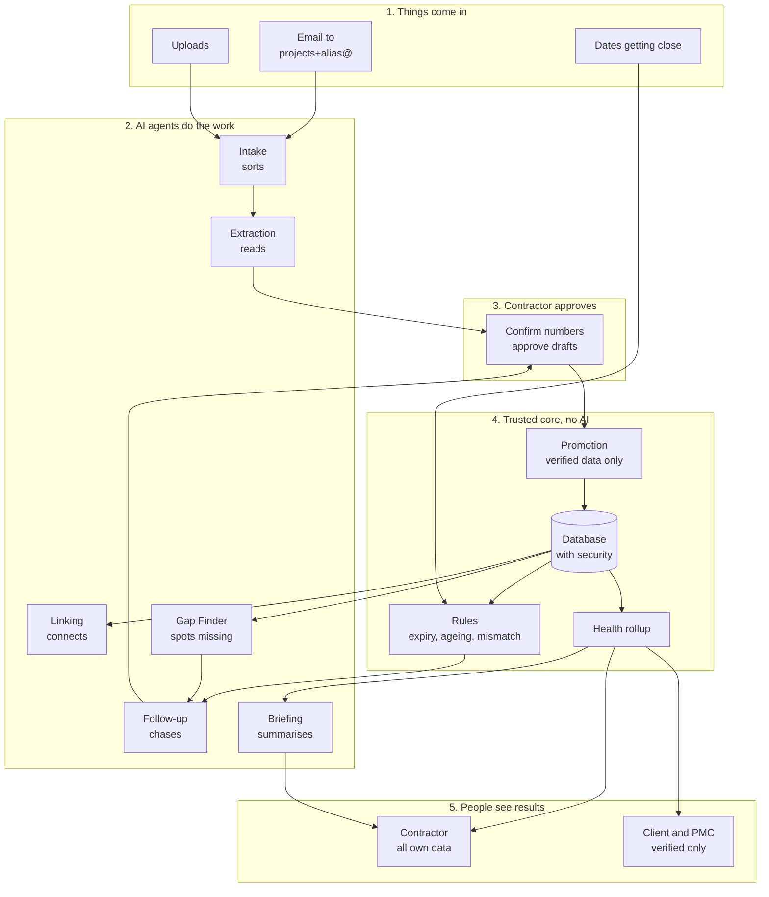
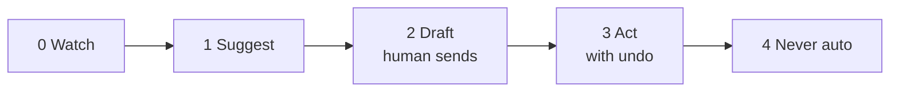
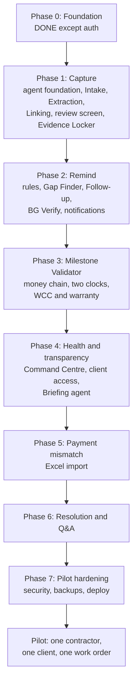
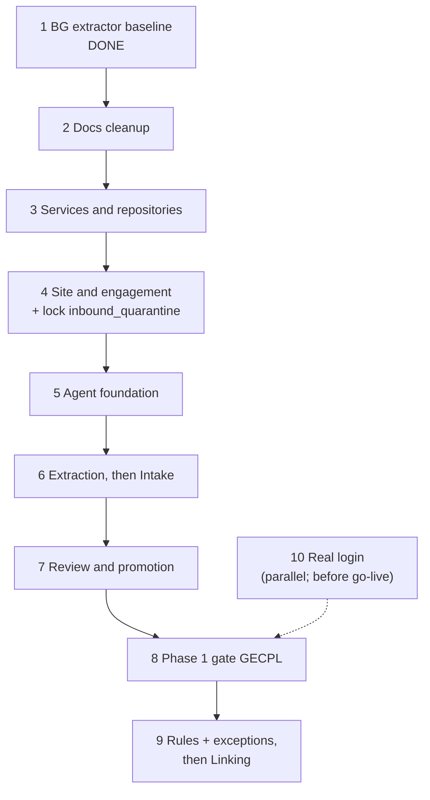
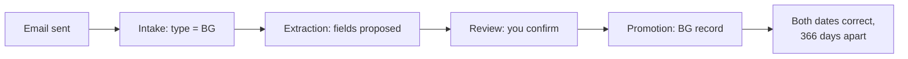

# EquiContracts: Start Here

One document to read before doing anything. It combines Master Plan v2 and the Agentic Design into:
- **Part A:** the whole product on one page
- **Part B:** the roadmap
- **Part C:** exactly what we do first, step by step, with your approval at each step

The two full documents stay as reference:
- `docs/plans/MASTER_PLAN_v2.md`: screens, data model, metrics, issues
- `docs/architecture/AGENTIC_DESIGN.md`: agents, safety, tools

---

# Part A: The whole product on one page

## Why

| Problem | Answer |
|---|---|
| Documents scattered across email, WhatsApp, laptops | One inbox, one Evidence Locker, sorted automatically |
| Nobody gets reminded before things expire | Agents and rules watch every date and chase the right person |
| No one can see which project is in trouble | Health rolls up from each item to the whole portfolio |
| Contractor and client keep different versions of the truth | Both see the same verified data, every number links to its source |

**One rule:** Contractor feeds. Client sees. Platform structures, verifies, and surfaces exceptions.

## How it works

**Read it left to right:**
1. Documents arrive by email or upload
2. Agents sort them, read them, connect them, notice gaps, and draft follow-ups
3. The contractor confirms anything involving money and approves anything going to the client
4. Only confirmed data enters the trusted core, where plain code (no AI) checks rules and calculates health
5. Contractor sees everything of their own. Client and PMC see verified data only.

## The building blocks

| Block | What it is |
|---|---|
| **Site** | The client's building (Lodha Supremus). Can have many contractors. |
| **Engagement** | One contractor's work on one site. Has its own inbox alias. |
| **Work order** | The contract. One engagement can have several. |
| **Item** | Anything with a status: BG, proforma, certified bill, WCC, warranty |
| **Exception** | A problem a rule found on an item |
| **Agent** | An AI worker with one job, a set of tools, and a human who approves |
| **Proposal** | What an agent suggests. Becomes real only when approved (or when safe enough to auto-apply). |

## The modules

| Module | Need | Screens |
|---|---|---|
| Evidence Locker | One place | S20 |
| BG Verify | Reminders | S12 to S16 |
| Milestone Validator | Reminders, money | S5 to S11 |
| Command Centre and Health | Health, transparency | S21, S4 |
| Payment Mismatch | Money | to design |
| Resolution and Q&A | Transparency, disputes | S17 to S19 |

## The eight agents

| Agent | Job | Acts alone on | Always asks a human for |
|---|---|---|---|
| Intake | Sort documents | Type, importance, splitting | Unclear project link |
| Extraction | Read fields, self-check | Nothing important | Every money field |
| Linking | Connect records, spot contradictions | Exact matches | Fuzzy matches, contradictions |
| Gap Finder | Find what's missing | Raise and close gaps | Nothing (contractor decides the fix) |
| Follow-up | Remind and draft | Reminders to own team | Anything to the client, formal letters |
| Briefing | Morning digest, weekly report | Digest to own team | Report to the client |
| Q&A | Answer with sources | Answers | Refuses legal advice |
| Resolution | Build the dispute file | Nothing | Always reviewed before export |

## The safety rules (memorise these six)

1. **Agents propose, humans approve** anything about money or anything sent to the client
2. **Agents act only through tools.** No agent touches the database directly.
3. **Code does the maths, AI does the words.** Every number in AI-written text is checked against the data.
4. **The AI that reads client documents has no tools.** The AI with tools never sees raw client documents.
5. **Rules have no AI.** BG expiry is arithmetic.
6. **The database itself refuses** to mark a money field verified without a named human

## The autonomy ladder

- Every new agent action starts at **Level 2**
- It moves to Level 3 only after review data shows it is rarely corrected
- Money and risk acceptance stay at **Level 4** forever

---

# Part B: The roadmap

| Phase | Proves | Gate (real document, end to end) |
|---|---|---|
| 0 | Security works | Done: 39/39 tests, RLS proven |
| 1 | We can read a document correctly | GECPL BG email in, both expiry dates correct, BG record created |
| 2 | We remind the right person at the right time | Real BG produces the right reminders on a fixed date |
| 3 | We track where money is stuck | Shantigram and Runwal sheets parse with no retyping |
| 4 | Both sides see the same truth | Client sees two contractors on one site, verified only |
| 5 | We catch short payments | Real accounting export shows which component differs |
| 6 | We can prove what happened | Co-founder judges a generated statement sound |
| 7 | Safe to give to a real customer | Security checklist done, restore tested |

Phases 2 and 3 may swap. Co-founder decides (see Q1 in MASTER_PLAN_v2).

**Real-document gate:** every phase ends with one real document from `eval/eval_set_v0`
through the live pipeline. Unit tests prove pieces; only this proves they are wired.

**Tests:** prefer separable phase suites when they exist; before starting a phase, run the
previous phase's suite.

---

# Part C: What we do first

Ten steps. Each step: what, why, done when. **You approve each one before the next starts.**

## Formal decisions already logged

| DECISIONS.md | Plain meaning |
|---|---|
| D-018 | Routers, services, repositories inside the one repo |
| D-019 | Website first, mobile-friendly; native app later |
| D-020 | Eight agents, built phase by phase |
| D-021 | LangGraph where an agent must pause for a human |
| D-022 | Reader AI separate from actor AI |
| D-023 | New agent actions start at autonomy Level 2 |
| D-024 / D-025 | Provider-selectable LLM settings; free/local in dev; `model_version` on every run |
| D-026 | Site = client's building; engagement = one contractor's job on it |
| D-027 | Agents hand off through an event table; plain-code router; never call each other |
| D-029 | EquiAdvisor Facts mode + separate Advice mode |
| D-030 | One docs index; one decision log; no BOOK requirement |

Co-founder open questions are **Q1–Q10** in `docs/plans/MASTER_PLAN_v2.md` (never informal D numbers).

## Step 1: BG extractor baseline — **done**

- BG reader in `packages/extraction/`
- GECPL case: **4/4** fields match `eval/eval_set_v0/expected/gecpl-bg-invocation.json`
- `model_version`: `gemini-2.5-flash` via `LLM_PROVIDER` / `LLM_MODEL`

**Done when:** already met.

## Step 2: Docs cleanup — **this step**

- One index (`docs/README.md`), one decision log, honest HANDOFF/START_HERE
- Remove stale BOOK / HLD / LLD copies / old phase plans / ADR stubs with `git rm`
- Fix informal D labels → DECISIONS ids; co-founder items → Q#

**Done when:** `make verify` green; live docs match `docs/README.md`.

## Step 3: Services and repositories

- `repositories/`: all SQL
- `services/`: business logic
- `routers/`: HTTP only → call a service
- No behaviour change. Same tests pass. Prompt: `docs/prompts/02-service-layer.md`

**Why now:** agents call services through tools. Services must exist first.

**Done when:** no SQL left in any router, all tests pass, CI check added.

## Step 4: Site and engagement, plus lock `inbound_quarantine`

Same migration batch:

- `site`, `site_member`; rename `project` → `engagement`; add `site_id`
- Client/PMC access through the site
- Lock down `inbound_quarantine` (today deliberately open until tenant known — revisit with this model)
- **Tests:** two contractors on one site cannot see each other; client sees both, verified only
- Prompt: `docs/prompts/03-site-engagement.md`

**Done when:** migration applies clean; old and new tenancy tests pass.

## Step 5: Agent foundation

- `event` table + plain-code router (D-027)
- `agent_run`, `agent_step`, `agent_proposal`, `review_decision` + RLS
- Runtime, guardrails, empty tool belt, one fake test agent
- Prompt: `docs/prompts/04-agent-foundation.md`

**Done when:** fake agent runs end to end; a test proves a disallowed tool call fails.

## Step 6: Extraction Agent, then Intake Agent

- Move BG extractor into the runtime; self-checks; reader/actor split
- Then Intake: type, evidence weight, WO link, multi-attachment split
- `cases.json` already labels all 11 doc types — usable as Intake gold from day one
- Prompts: `05-extraction-agent.md`, `06-intake-agent.md`

**Done when:** GECPL extracted inside the runtime; Intake classifies the eval set correctly.

## Step 7: Review screen and promotion

- Confirm / correct / reject; every decision in `review_decision`
- Promotion: verified BG fields → real `bank_guarantee` row
- Prompt: `docs/prompts/07-review-screen.md`

**Done when:** contractor confirms BG fields in under a minute; BG record appears.

## Step 8: Phase 1 gate — GECPL end to end

Prompt: `docs/prompts/08-phase1-gate.md`

**Done when:** end to end with no manual database edits.

## Step 9: Rules and exceptions (Phase 2), then Linking Agent

- Deterministic BG rules + exceptions table
- Then Linking Agent (end of Capture)
- No prompt file yet

**Done when:** real BG produces the right reminders on a fixed clock; Linking matches exact IDs.

## Step 10: Real login

- Replace `X-Org-Id` header stub
- **Can run in parallel any time; must be done before anything goes online**
- No prompt file yet

**Done when:** header stub has zero effect outside local/test; checklist items for auth pass.

---

# How we work, every step

- **One step at a time.** You approve before the next starts.
- **Every step ends with `make verify` green.**
- **Every decision goes in `DECISIONS.md`.** Every new call path goes in `FLOW.md`.
- Update `docs/architecture/project-map.md` when architecture changes. No BOOK.md.
- **Max 3 agents in parallel**, only on steps that touch different folders.
- **Nothing merges without you seeing the result.** Real output, not a summary.

---

# Your next action

Finish Step 2 (docs cleanup), then start Step 3 (services and repositories).
