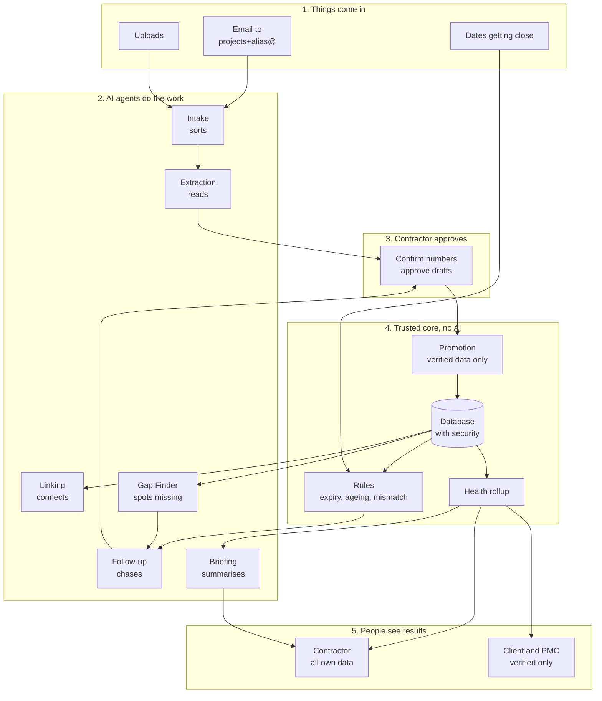
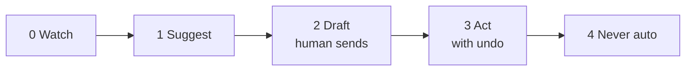
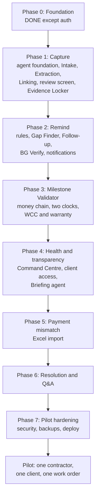
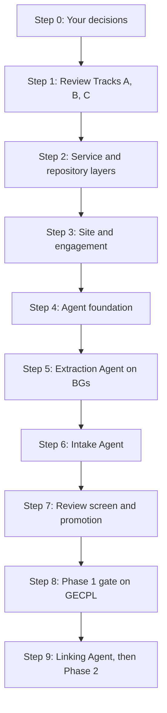
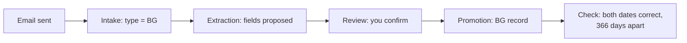

# EquiContracts: Start Here

One document to read before doing anything. It combines Master Plan v2 and the Agentic Design into:
- **Part A:** the whole product on one page
- **Part B:** the roadmap
- **Part C:** exactly what we do first, step by step, with your approval at each step

The two full documents stay as reference:
- `docs/plans/MASTER_PLAN_v2.md`: screens, data model, metrics, issues
- `docs/architecture/AGENTIC_DESIGN.md`: agents, safety, tools

---

# Part A: The whole product on one page

## Why

| Problem | Answer |
|---|---|
| Documents scattered across email, WhatsApp, laptops | One inbox, one Evidence Locker, sorted automatically |
| Nobody gets reminded before things expire | Agents and rules watch every date and chase the right person |
| No one can see which project is in trouble | Health rolls up from each item to the whole portfolio |
| Contractor and client keep different versions of the truth | Both see the same verified data, every number links to its source |

**One rule:** Contractor feeds. Client sees. Platform structures, verifies, and surfaces exceptions.

## How it works

**Read it left to right:**
1. Documents arrive by email or upload
2. Agents sort them, read them, connect them, notice gaps, and draft follow-ups
3. The contractor confirms anything involving money and approves anything going to the client
4. Only confirmed data enters the trusted core, where plain code (no AI) checks rules and calculates health
5. Contractor sees everything of their own. Client and PMC see verified data only.

## The building blocks

| Block | What it is |
|---|---|
| **Site** | The client's building (Lodha Supremus). Can have many contractors. |
| **Engagement** | One contractor's work on one site. Has its own inbox alias. |
| **Work order** | The contract. One engagement can have several. |
| **Item** | Anything with a status: BG, proforma, certified bill, WCC, warranty |
| **Exception** | A problem a rule found on an item |
| **Agent** | An AI worker with one job, a set of tools, and a human who approves |
| **Proposal** | What an agent suggests. Becomes real only when approved (or when safe enough to auto-apply). |

## The modules

| Module | Need | Screens |
|---|---|---|
| Evidence Locker | One place | S20 |
| BG Verify | Reminders | S12 to S16 |
| Milestone Validator | Reminders, money | S5 to S11 |
| Command Centre and Health | Health, transparency | S21, S4 |
| Payment Mismatch | Money | to design |
| Resolution and Q&A | Transparency, disputes | S17 to S19 |

## The eight agents

| Agent | Job | Acts alone on | Always asks a human for |
|---|---|---|---|
| Intake | Sort documents | Type, importance, splitting | Unclear project link |
| Extraction | Read fields, self-check | Nothing important | Every money field |
| Linking | Connect records, spot contradictions | Exact matches | Fuzzy matches, contradictions |
| Gap Finder | Find what's missing | Raise and close gaps | Nothing (contractor decides the fix) |
| Follow-up | Remind and draft | Reminders to own team | Anything to the client, formal letters |
| Briefing | Morning digest, weekly report | Digest to own team | Report to the client |
| Q&A | Answer with sources | Answers | Refuses legal advice |
| Resolution | Build the dispute file | Nothing | Always reviewed before export |

## The safety rules (memorise these six)

1. **Agents propose, humans approve** anything about money or anything sent to the client
2. **Agents act only through tools.** No agent touches the database directly.
3. **Code does the maths, AI does the words.** Every number in AI-written text is checked against the data.
4. **The AI that reads client documents has no tools.** The AI with tools never sees raw client documents.
5. **Rules have no AI.** BG expiry is arithmetic.
6. **The database itself refuses** to mark a money field verified without a named human

## The autonomy ladder

- Every new agent action starts at **Level 2**
- It moves to Level 3 only after review data shows it is rarely corrected
- Money and risk acceptance stay at **Level 4** forever

---

# Part B: The roadmap

| Phase | Proves | Gate (real document, end to end) |
|---|---|---|
| 0 | Security works | Done: 39/39 tests, RLS proven |
| 1 | We can read a document correctly | GECPL BG email in, both expiry dates correct, BG record created |
| 2 | We remind the right person at the right time | Real BG produces the right reminders on a fixed date |
| 3 | We track where money is stuck | Shantigram and Runwal sheets parse with no retyping |
| 4 | Both sides see the same truth | Client sees two contractors on one site, verified only |
| 5 | We catch short payments | Real accounting export shows which component differs |
| 6 | We can prove what happened | Co-founder judges a generated statement sound |
| 7 | Safe to give to a real customer | Security checklist done, restore tested |

Phases 2 and 3 may swap. Co-founder decides.

---

# Part C: What we do first

Nine steps. Each step: what, why, done when. **You approve each one before the next starts.**

## Step 0: Install the kit and confirm decisions

**Install:** run `docs/prompts/00-install-kit.md` in Claude Code.

**Decided**

| # | Decision | Status |
|---|---|---|
| D1 | Organise code into routers, services, repositories (folders inside the one repo) | Yes |
| D8 | Website first, mobile-friendly. Native app later. | Yes |
| D15 | Adopt the 8-agent design, built phase by phase | Yes |
| D17 | LangGraph for agents that pause for a human | Yes |
| D18 | Separate reader AI and actor AI | Yes |
| D19 | New agent actions start at Level 2 | Yes |

**Still to confirm (recommendation: yes)**

| # | Plain meaning |
|---|---|
| D5 | **Site** = the client's building. **Engagement** = one contractor's job on it. Needed so a client sees one building with several contractors. |
| D9 | EquiAdvisor answers facts from your data and drafts letters. No advice for now. |
| D16 | Agents pass work through a shared event board, not by calling each other directly |

**Send your co-founder:** module order, who pays, Idle vs Redundant BG, "Seals", trophy icon, rule thresholds, more documents.

**Send your designer:** S8 interest is 10x wrong, S15 split savings vs capacity, claim expiry column, Attention state on Command Centre, design the Review screen.

**Done when:** kit installed, D5 / D9 / D16 answered, lists sent.

## Step 1: Review Tracks A, B, C

Three parallel tracks are already running. Before anything new, finish them.

| Track | What it built | Check |
|---|---|---|
| A | BG extractor | Field-by-field comparison with GECPL expected output. Both dates 366 days apart? Missing fields reported as unresolved, not guessed? |
| B | Exceptions table and 5 BG rules | What signal did it use for "idle BG"? Boundary tests (30 days fires, 31 doesn't)? |
| C | Real auth | Old header login has zero effect outside dev/test? All 39 tests still pass? |

- Merge **one at a time**, `make verify` between each merge
- Bring me each track's report before merging

**Done when:** all three merged, `make verify` green.

## Step 2: Service and repository layers

Small refactor so the code is organised before it grows.

- `repositories/`: all SQL moves here
- `services/`: business logic moves here
- `routers/`: only receive the request, call a service, return the response
- No behaviour changes. Same tests pass.

**Why now:** agents will call services through tools. Services must exist first.

**Done when:** no SQL left in any router, all tests pass, CI check added.

## Step 3: Site and engagement

- New migration: `site`, `site_member`, rename `project` to `engagement`, add `site_id`
- Update security rules so client/PMC access goes through the site
- **New tests:** two contractors on one site cannot see each other. Client sees both, verified only.

**Why now:** every week of data makes this migration harder. The client view and agents both depend on it.

**Done when:** migration applies clean, old and new tenancy tests pass.

## Step 4: Agent foundation

The engine all eight agents run on. No real agents yet.

- `event` table and the plain-code router (event → agent table)
- `agent_run`, `agent_step`, `agent_proposal`, `review_decision` tables, with security rules
- Runtime: runs an agent, enforces max steps, retries, cost limit
- Guardrails: tool allowlist, autonomy levels, number check
- Empty tool belt with 2 read-only tools
- **One fake test agent** that receives an event, calls a tool, creates a proposal

**Done when:** fake agent runs end to end, every step logged, a test proves an agent cannot call a tool it isn't allowed.

## Step 5: Extraction Agent on BGs

- Move Track A's extractor into the agent runtime
- Add self-checks: claim expiry on or after expiry, dates valid, amount positive
- Reader/actor split: extractor has no write tools beyond `propose_fields`
- Add one injection test document to the eval set. It must cause no action.

**Done when:** GECPL extracted inside the runtime, self-checks pass, injection test passes, eval report shows financial and non-financial accuracy separately.

## Step 6: Intake Agent

- Decides document type and evidence weight, links to work order
- Splits an email with several attachments into several documents
- Small, fast model

**Done when:** on the eval set, the BG lands as "bank guarantee", DMRC and Jai Vijay land as "potential dispute".

## Step 7: Review screen and promotion

- The screen your designer is creating: what the agent read, the page it came from, confidence, approve / correct / reject
- Every decision saved to `review_decision`
- Promotion: verified BG fields create the real `bank_guarantee` record

**Done when:** a contractor can confirm all 8 BG fields in under a minute, and the BG record appears.

## Step 8: Phase 1 gate

Forward the real GECPL email to a real project address and watch:

**Done when:** it works end to end with no manual database edits. This is the moment the product stops being a skeleton.

## Step 9: Then

- Linking Agent (end of Phase 1)
- Phase 2: Gap Finder, Follow-up, BG Verify screens, notifications
- Re-plan with whatever the co-founder has answered by then

---

# How we work, every step

- **One step at a time.** You approve before the next starts.
- **Every step ends with `make verify` green.**
- **Every decision goes in `DECISIONS.md`.** Every new call path goes in `FLOW.md`.
- **Max 3 agents (Cursor/Claude Code) in parallel**, only on steps that touch different folders.
- **Nothing merges without you seeing the result.** Real output, not a summary.

---

# Your next action

Answer the nine decisions in Step 0. Then paste me Track A, B, and C results and we start Step 1.
